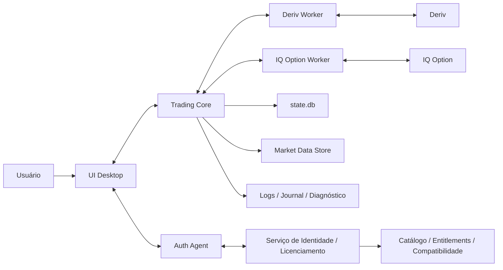
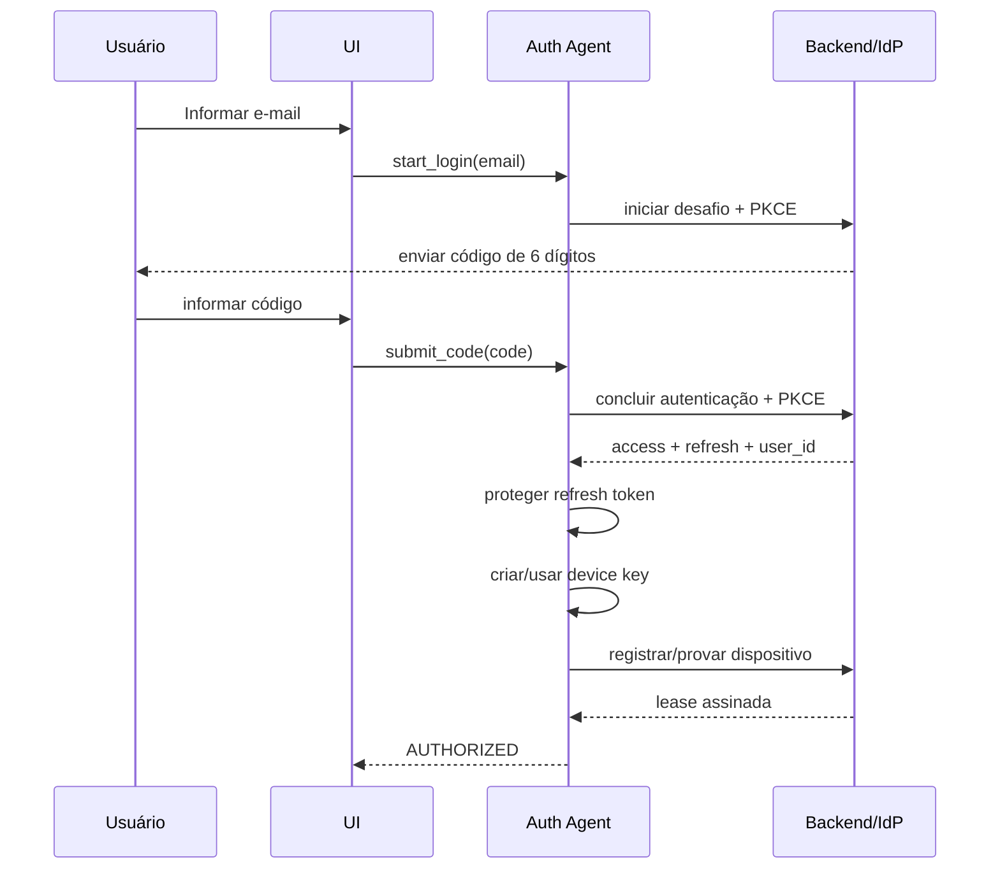
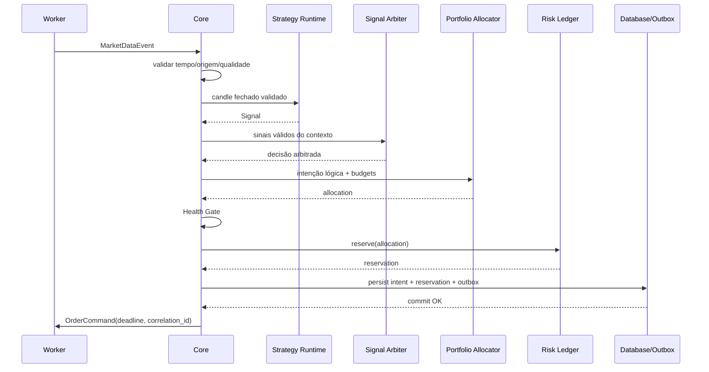
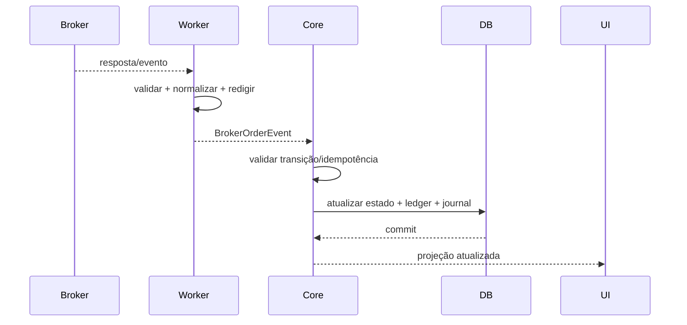

# Arquitetura Resiliente — Trading Lab Desktop

**Projeto:** Trading Lab Desktop

**Baseline executável:** v1.9.11

**Versão documental:** 1.9.11

**Status:** arquitetura atual documentada e arquitetura-alvo demarcada

**Atualizado em:** 2026-08-26

**Plataforma inicial:** Windows 10/11 64 bits
**Documentos normativos relacionados:** `PRD_Trading_Desktop_Deriv_IQOption.md`, `RULES.md`, `AIGUARD.md`, `AGENTS.md`, `WORKLOG.md`

---

## 0. Baseline implementada v1.9.11

Esta seção prevalece quando uma seção histórica ou futura deste documento usar “deve”, “MVP” ou
“pretendida”. O código executável atual possui a seguinte topologia:

```text
TradingLabDesktop.exe (launcher portátil C#)
├── UI PySide6 (Workspaces Dedicados Deriv & IQ Option)
├── Auth Agent local (DPAPI CurrentUser)
├── Trading Core / único writer de state.db
│   ├── Deriv Auto Trader (Digit Edge, Over/Under, Differs, Even/Odd)
│   ├── IqOption Auto Trader (Multi-Asset Radar, RSI 14, Bollinger, Moving Averages)
│   ├── Stealth Anti-Detection Layer (Jitter 50-250ms, Browser Headers, Realistic Pacing)
│   ├── Risk Ledger & Health Gate (Stop Loss, Take Profit, Max Consecutive Losses)
│   └── Durable Outbox & Reconciliation Coordinator
├── Deriv Worker (Conta Demo / Real)
└── IQ Option Worker (Conta Practice / Real + WebSocket Stealth)
```

| Caminho | Estado |
|---|---|
| Deriv pública | implementado |
| Deriv Demo autenticada | implementado; capacidade financeira habilitada após seleção e armamento explícito |
| Deriv Real autenticada | implementado; monitoramento e submissão quando autorizada pelo operador |
| IQ Option externa | implementado; perfil/saldo Practice ou Real; Radar Multi-Ativos (`AUTO`); execução automatizada Practice e Real com proteção stealth anti-detecção |

O bot Deriv inicia pausado. As três estratégias Digit Edge consomem ticks de um segundo, exigem
500 ticks de aquecimento e podem usar seleção automática entre `R_10`, `R_25`, `R_50`, `R_75` e
`R_100`. O caminho financeiro mantém uma ordem Deriv em voo, consome cada sinal uma vez e não
reenvia submissão ambígua. O Martingale é opcional, limitado e desligado por padrão.

Para descrição operacional por componente, consulte
[docs/CURRENT_ARCHITECTURE.md](docs/CURRENT_ARCHITECTURE.md) e
[docs/COMPONENT_REFERENCE.md](docs/COMPONENT_REFERENCE.md).

---

## 1. Objetivo

Esta arquitetura define como o Trading Lab Desktop executa estratégias automatizadas na Deriv
Demo e como poderá incorporar a IQ Option de forma local, auditável e tolerante a falhas, sem
transformar indisponibilidade de rede, corretora, processo, banco, identidade ou estratégia em
exposição financeira não controlada.

O desenho preserva os princípios já definidos para a arquitetura resiliente v1:

- Trading Core único como autoridade financeira local;
- Deriv e IQ Option isoladas em workers independentes;
- intenção, reserva de risco e outbox persistidas antes do envio;
- estado `UNKNOWN` para submissões potencialmente aceitas mas não confirmadas;
- Risk Ledger conservador;
- Health Gate fail closed;
- reconciliação após falha/restart;
- persistência crítica separada de dados volumosos de mercado;
- UI sem autoridade financeira;
- execução demo/practice como padrão.

A versão 1.1 acrescenta duas capacidades estruturais:

1. **identidade, dispositivo e licenciamento**, com login do produto por e-mail + código, cliente público/PKCE, tokens rotativos, device key e lease assinada;
2. **plataforma multi-estratégias**, com Strategy Catalog, Strategy Runtime isolado, Signal Arbiter, Portfolio Allocator e Validation Registry.

Nenhuma dessas capacidades altera a regra principal: **o Trading Core continua sendo a única autoridade sobre o estado financeiro local**.

---

## 2. Princípios arquiteturais

### 2.1 Falhar fechado

Quando o sistema não consegue provar que é seguro abrir uma nova operação, a resposta correta é bloquear novas entradas, preservar evidências e reconciliar.

Falhas que fecham o gate incluem, entre outras:

- banco indisponível ou inconsistente;
- relógio da corretora não sincronizado;
- dados atrasados, incompletos ou com gap crítico;
- payout/payoff inválido ou expirado;
- worker incompatível;
- protocolo IPC incompatível;
- ordem ambígua;
- reconciliação pendente;
- lease inválida/expirada para novas entradas;
- entitlement ausente;
- manifesto de estratégia incompatível;
- hash/assinatura de estratégia inválido;
- estratégia suspensa;
- orçamento de risco indisponível.

### 2.2 Persistir antes de agir

Nenhum comando financeiro pode sair do Core antes de a mesma transação persistir:

1. `TradeIntent`;
2. `RiskReservation`;
3. registro de `Outbox`.

O dispatch só ocorre depois do commit.

### 2.3 Ambiguidade não é rejeição

Timeout ou perda de conexão depois de uma submissão potencialmente aceita produz `UNKNOWN`.

O sistema não deve:

- reenviar automaticamente;
- liberar a reserva por tempo decorrido;
- converter `UNKNOWN` em `REJECTED`;
- assumir liquidação;
- permitir nova entrada no mesmo escopo enquanto a ambiguidade relevante permanecer.

### 2.4 Isolamento por corretora

Deriv e IQ Option possuem:

- processos independentes;
- dependências independentes;
- autenticação independente;
- circuit breakers independentes;
- mapeadores independentes;
- estado de saúde independente.

Uma falha no IQ Option Worker não deve derrubar o Deriv Worker, e vice-versa.

### 2.5 Estratégia não executa trade

Uma estratégia:

- recebe dados já validados;
- mantém estado isolado;
- produz um sinal com validade e evidência;
- não decide a stake final;
- não reserva risco;
- não grava estado financeiro;
- não chama APIs das corretoras.

### 2.6 Identidade não é corretora

A identidade DualTrade controla:

- usuário;
- sessão;
- dispositivo;
- plano;
- entitlement;
- compatibilidade;
- strategy packs;
- autorização para modo real quando essa fase existir.

Ela não recebe:

- senha Deriv;
- senha IQ Option;
- cookies IQ;
- tokens de corretora;
- ordens;
- saldo operacional;
- histórico completo de trading.

---

## 3. Visão de contexto



O caminho crítico de execução financeira permanece local:

```text
Market Data
    ↓
Trading Core
    ↓
Strategy Runtime
    ↓
Signal Arbiter
    ↓
Portfolio Allocator
    ↓
Risk Ledger
    ↓
Trade Intent + Risk Reservation + Outbox
    ↓
Worker da corretora
    ↓
Corretora
```

O serviço remoto não participa desse caminho de baixa latência e não envia ordens.

Para pesquisa de market data read-only, existe um caminho operacional separado do caminho
financeiro: `BrokerShadowSession` compartilha um único worker/cliente por broker entre séries e
`BrokerShadowSoakRunner` executa ciclos bounded sobre essa sessão, agregando telemetria do processo
Core e do subprocesso filho. Esse soak só observa, reinicia explicitamente a sessão read-only dentro
de limites configurados e encerra fechado quando não consegue comprovar saúde operacional; ele não
cria `TradeIntent`, `RiskReservation`, Outbox, comando de ordem ou retry financeiro. A camada
temporal (`BrokerShadowTemporalSoakRunner`) adiciona janela monotônica, teto de ciclos, critérios de
aceitação e relatório JSON redigido para evidência operacional local, sem transformar telemetria em
payload de mercado bruto ou estado financeiro.
Uma matriz temporal bounded compara múltiplos cenários locais com IDs únicos, cadências e falhas
programadas. Falha ou exceção em um cenário não interrompe os seguintes; o resultado agregado falha
fechado, encerra a sessão read-only afetada e preserva somente relatórios já redigidos.
O CLI local de soak é uma fronteira operacional opt-in, não um serviço do Core financeiro. Ele
valida duração/ciclos/retenção contra tetos, executa cenários sintéticos em `DECISION_ONLY`, publica
o relatório com temporário no mesmo volume + `os.replace` e remove somente arquivos
`soak_matrix_*.json` antigos dentro do diretório configurado. Falha de escrita/retenção retorna
código não-zero e nunca habilita dispatch.
Perfis operacionais apenas escolhem duração/ciclos/amostras dentro dos tetos. Fault presets geram
uma `FaultSchedule` determinística e redigida; perda simulada do worker e suspensão entram em
recovery read-only, enquanto backpressure vira falha de poll contabilizada. Antes de publicar, o
payload é verificado pelo scanner local bounded. O ensaio de restore continua fora do startup de
produto: copia um backup consistente para outro perfil temporário, cria marker, executa checks
SQLite e abre um novo Core sem tocar na evidência original.

---

## 4. Topologia de processos locais

```text
Launcher / Supervisor
├── UI
├── Auth Agent
│   ├── Login / PKCE
│   ├── Token Vault
│   ├── Device Identity
│   ├── Lease Verifier
│   └── Renewal Coordinator
├── Trading Core
│   ├── Command Bus
│   ├── Event Bus
│   ├── State Machines
│   ├── Health Gate
│   ├── Capability Registry
│   ├── Market Data Normalization
│   ├── Strategy Catalog Local
│   ├── Strategy Runtime
│   ├── Signal Arbiter
│   ├── Portfolio Allocator
│   ├── Risk Ledger
│   ├── Durable Outbox
│   ├── Single Database Writer
│   ├── Recovery Coordinator
│   └── Projections / Journal
├── Deriv Worker
└── IQ Option Worker
```

### 4.1 Launcher / Supervisor

Responsabilidades:

- iniciar os processos na ordem suportada;
- negociar versão de protocolo;
- detectar processo morto;
- reiniciar componentes não financeiros quando seguro;
- não reexecutar automaticamente comando financeiro;
- coordenar encerramento limpo;
- impedir duas instâncias concorrentes do mesmo perfil.

O Supervisor não possui autoridade para inferir resultado de ordem.

Na v1.9.11, `ProcessTreeSupervisor` combina `profile.lock`, mutex nativo, canal de lifecycle e
Windows Job Object. O launcher portátil traz a janela existente para frente em uma segunda
abertura. O host do Core compõe a sequência lógica `Auth Agent → Core/DB/recovery → workers`,
incluindo Deriv pública e, depois do login interno, Deriv Demo financeira ou Deriv Real read-only.
O Core continua dono dos supervisores IPC e é o único processo que abre `state.db`.

O canal Launcher ↔ Core usa envelope IPC v1, token efêmero de 256 bits entregue por `stdin` e prova
HMAC sobre nonces. O shutdown segue `HG_SAFE_STOP → drain bounded de eventos já enfileirados →
workers → Auth Agent → Core/writer/locks`. ACK expirado escala para `terminate()` e `kill()`. A
drenagem não aguarda settlement futuro nem altera estado de ordem; estado não terminal permanece
para recovery/reconciliação.

No Windows, o Core é atribuído ao Job Object antes de receber a configuração e seus descendentes o
herdam. Fechar o handle do Job ou perder abruptamente o Launcher encerra a árvore sem deixar filho
órfão; como crash do Launcher não permite diálogo seguro, o próximo Core ainda deve executar
integridade, recovery e reconciliação. Queda do Core encerra toda a árvore. Queda do worker
financeiro apenas degrada e não é reiniciada cegamente pelo Launcher. A recuperação da sessão
Deriv autenticada usa reinício limitado, OTP novo, restauração de subscriptions e reconciliação;
ela nunca rearma o bot nem reenvia ordem ambígua.

### 4.2 UI

A UI:

- apresenta projeções do Core;
- exibe broker, conta, modo, moeda e saúde;
- recebe configuração do usuário;
- solicita login ao Auth Agent;
- solicita conexão de broker ao Core/worker via contratos definidos;
- mostra bloqueios com código estável;
- diferencia “parar novas entradas” de “encerrar aplicativo”.

A UI não:

- chama API de corretora;
- grava `state.db`;
- altera Risk Ledger;
- executa estratégia;
- mantém estado financeiro autoritativo.

Fechar/travar a UI não deve invalidar o estado financeiro já persistido.

### 4.3 Auth Agent

O Auth Agent é responsável somente pela identidade do produto.

Na implementação local, o Auth Agent de identidade do produto ainda é simulado. Seu vault usa
DPAPI `CurrentUser`, DACL protegida pelo SID do token atual e envelopes versionados publicados por
replace atômico. A credencial Deriv usa armazenamento DPAPI separado e não se confunde com a
identidade/licença do produto.

O Auth Agent executa em subprocesso. O supervisor entrega um token efêmero de 256 bits por `stdin`;
o handshake TCP loopback valida token/roles/version/deadline e prova o servidor por HMAC sobre
nonces. O Core financeiro consulta somente allow/block + reason + expiração. Perda do processo gera
`HG_AUTH_AGENT_UNAVAILABLE` para novas entradas e não participa do caminho de eventos,
reconciliação ou liquidação.

Responsabilidades:

- iniciar login por e-mail + código;
- executar Authorization Code + PKCE quando aplicável;
- armazenar/renovar sessão;
- criar e manter identidade criptográfica do dispositivo;
- verificar lease assinada;
- expor ao Core somente um estado reduzido de autorização;
- realizar renovação silenciosa;
- solicitar reautenticação quando necessária.

O Core não precisa conhecer refresh token, código OTP ou chave privada.

### 4.4 Trading Core

O Core é o único processo autorizado a decidir e persistir estado financeiro local.

Responsabilidades:

- validar dados;
- manter máquinas de estado;
- controlar Health Gate;
- executar Strategy Runtime;
- arbitrar sinais;
- aplicar alocação;
- reservar/liberar risco;
- persistir intenção/outbox;
- despachar comandos;
- processar eventos financeiros;
- reconciliar;
- gerar projeções;
- consolidar journal e auditoria.

### 4.5 Workers

Workers traduzem entre o protocolo interno e a corretora.

Na v1.9.11, o Deriv Worker possui caminhos público, autenticado e financeiro Demo. O IQ Option
Worker autentica por protocolo comunitário não oficial, confirma perfil/saldo de Practice ou Real
e publica somente capacidades read-only. Não há rota de submissão ou reconciliação de ordens IQ.

Eles:

- autenticam na corretora;
- consultam capacidades;
- recebem dados;
- enviam comandos já autorizados;
- recebem eventos;
- normalizam respostas;
- preservam proveniência redigida;
- aplicam deadlines;
- implementam reconexão/circuit breaker.

Eles não:

- executam estratégia;
- escolhem stake final;
- alteram Risk Ledger;
- gravam estado financeiro;
- fazem retry cego de submissão.

---

## 5. Plano de controle remoto mínimo

O produto pode usar um backend remoto para capacidades de controle, mas não para trading.

```text
Control Plane
├── Customer Identity
├── E-mail OTP / IdP
├── Device Registry
├── Session / Token Service
├── Subscription
├── Entitlements
├── Signed License Leases
├── Strategy Catalog Metadata
├── Compatibility Manifest
├── Update Metadata
└── Telemetry opt-in
```

### 5.1 Dados permitidos

Exemplos:

- `user_id`;
- e-mail normalizado;
- status da conta;
- `device_id`;
- chave pública do dispositivo;
- plano;
- status da assinatura;
- brokers liberados;
- strategy packs;
- `real_mode_allowed`;
- limite de dispositivos;
- versão mínima/máxima compatível;
- emissão/expiração da lease.

### 5.2 Dados proibidos

Não devem ser enviados ao plano de controle:

- credenciais Deriv;
- credenciais IQ;
- cookies de broker;
- token de broker;
- saldo financeiro operacional;
- ordem individual completa;
- histórico completo de trades;
- payload bruto contendo segredo.

---

## 6. Arquitetura de identidade e licenciamento

### 6.1 Identidades distintas

O sistema separa:

| Elemento | Função |
|---|---|
| E-mail | login visível do cliente |
| `user_id` | identidade interna estável |
| Access token | autentica chamada curta ao plano de controle |
| Refresh token | renova sessão |
| `device_id` | identifica instalação registrada |
| Device key | prova posse do dispositivo |
| License lease | autoriza recursos offline por tempo limitado |
| Broker credential | autentica somente na corretora correspondente |

### 6.2 Login

Fluxo recomendado:



O desktop é cliente público e não possui `client_secret` confiável.

### 6.3 Identidade do dispositivo

Na primeira ativação:

1. gerar `device_id` aleatório;
2. gerar par de chaves;
3. proteger chave privada no escopo do usuário do Windows;
4. enviar somente a chave pública ao backend;
5. registrar `user_id + device_id + public_key`;
6. receber lease assinada.

Não usar como autenticação principal:

- serial do disco;
- MAC address;
- fingerprint estável de hardware.

### 6.4 Armazenamento local

Material sensível deve ser protegido no escopo do usuário do Windows:

- refresh token;
- chave privada do dispositivo;
- lease quando ela contiver dados que não devam ficar em claro;
- credenciais IQ quando o usuário optar por persistência.

Não usar escopo equivalente a `LOCAL_MACHINE` para compartilhar segredo entre usuários do mesmo computador.

### 6.5 Lease

A lease deve conter ou permitir verificar, no mínimo:

```text
lease_id
user_id
device_id
issued_at
expires_at
plan
broker_access[]
strategy_packs[]
real_mode_allowed
max_devices / policy reference
client_version_constraints
nonce / key id
signature
```

O desktop possui somente material público necessário à verificação de assinatura.

### 6.6 Duração

Tetos definidos:

- practice: até 7 dias sem renovação;
- real, quando formalmente habilitado: até 24 horas sem renovação.

Access token deve ser curto e refresh token rotativo.

### 6.7 Expiração e indisponibilidade

```text
Lease válida + backend indisponível
→ continuar dentro dos entitlements locais.

Lease expirada
→ bloquear novas entradas.

Entitlement revogado
→ bloquear novas entradas após a revogação ser conhecida/renovada.

Ordens abertas
→ continuar monitorando e liquidando.

Histórico/replay/relatórios locais
→ continuar disponíveis quando não exigirem recurso remoto.
```

Falha de licença não encerra worker no meio de uma operação.

---

## 7. Autenticação das corretoras

### 7.1 Deriv

Para distribuição comercial:

- preferir OAuth da Deriv;
- usuário autoriza diretamente a corretora;
- credencial resultante permanece no domínio local da integração;
- escopos são validados antes de `READY`.

PAT pode ser admitido apenas em protótipo/desenvolvimento explicitamente permitido.

### 7.2 IQ Option

Como a integração não possui o mesmo contrato de API oficial:

- autenticação ocorre dentro do IQ Option Worker;
- e-mail/senha IQ não passam pelo backend DualTrade;
- cookies e respostas de autenticação não são logados;
- armazenamento de senha é opcional;
- quando persistida, usa proteção vinculada ao usuário do Windows;
- uma credencial Practice persistida pode ser reutilizada pelo worker no startup sem novo diálogo;
- uma seleção Real persistida nunca é ativada automaticamente e exige confirmação explícita;
- sessão inválida volta para estado de autenticação;
- falhas repetidas acionam circuit breaker.

---

## 8. Protocolo IPC

Toda comunicação entre processos usa protocolo versionado e envelopes identificados.

Envelope conceitual:

```text
Envelope
├── protocol_version
├── message_id
├── correlation_id
├── causation_id
├── source
├── target
├── message_type
├── created_at_utc
├── deadline_at
├── account_id? 
├── payload
└── integrity / framing metadata
```

Regras:

- mensagens financeiras possuem `message_id` e `correlation_id`;
- comandos possuem deadline;
- worker recusa comando expirado;
- tamanho de mensagem é limitado;
- filas são limitadas;
- eventos financeiros não podem ser descartados;
- payload externo é validado antes de entrar no domínio;
- não usar `pickle` ou desserialização arbitrária.

---

## 9. Estado de sessão da corretora

Estado de alto nível recomendado:

```text
DISCONNECTED
    ↓
AUTHENTICATING
    ↓
SYNCING
    ↓
READY
    ↓
DEGRADED / RECONNECTING
    ↓
SYNCING
    ↓
READY
```

Transições adicionais:

```text
AUTH_FAILED
INCOMPATIBLE
BLOCKED
STOPPING
STOPPED
```

Reconexão nunca retorna diretamente a `READY`.

Depois de reconectar:

1. sincronizar relógio;
2. validar conta/modo/moeda;
3. atualizar catálogo/capabilities;
4. consultar posições/contratos;
5. reconciliar ordens não terminais;
6. validar saldo;
7. reavaliar Health Gate;
8. somente então retornar a `READY`.

---

## 10. Estado de ordem

Modelo conceitual:

```text
CREATED
  ↓
RISK_RESERVED
  ↓
OUTBOXED
  ↓
DISPATCHING
  ├──→ ACCEPTED → OPEN → SETTLED
  ├──→ REJECTED
  └──→ UNKNOWN → RECONCILING
                    ├──→ ACCEPTED / OPEN
                    ├──→ SETTLED
                    ├──→ REJECTED (somente com evidência)
                    └──→ MANUAL_REVIEW
```

A liquidação também pode produzir `SETTLEMENT_UNKNOWN` quando a operação existe, mas o resultado financeiro não pôde ser comprovado.

### 10.1 Idempotência

Eventos duplicados:

- não criam segunda ordem;
- não liberam risco duas vezes;
- não regredem estado terminal;
- podem atualizar evidência/proveniência quando compatível.

### 10.2 Serialização

Comandos financeiros são serializados por:

```text
broker + account
```

Para o MVP, uma operação simultânea por conta simplifica a exclusão mútua, mas a arquitetura não depende de booleano informal.

---

## 11. Risk Ledger

O Risk Ledger é parte do Trading Core.

Ele mantém:

- saldo conhecido;
- exposição reservada;
- exposição aberta;
- exposição desconhecida;
- P&L realizado;
- limites por conta;
- limites globais;
- orçamento por estratégia quando aplicável;
- moeda explícita.

Valores monetários usam `Decimal` ou minor units, nunca `float`.

### 11.1 Reserva

Antes do envio:

```text
signal arbitrado
→ allocation
→ risk check
→ reserve
→ persist TradeIntent + RiskReservation + Outbox
→ commit
→ dispatch
```

### 11.2 Exposição conservadora

Contam como exposição:

- reservas ainda não enviadas;
- ordens aceitas/abertas;
- `UNKNOWN`;
- `SETTLEMENT_UNKNOWN`.

Reserva só é liberada com transição suportada por evidência.

---

## 12. Durable Outbox

A Durable Outbox elimina o intervalo perigoso entre “decidi enviar” e “registrei que deveria enviar”.

Na mesma transação:

```sql
BEGIN;
  INSERT trade_intent ...;
  INSERT risk_reservation ...;
  INSERT outbox_message ...;
COMMIT;
```

O dispatcher:

1. lê item pendente;
2. verifica deadline;
3. marca tentativa/estado adequado;
4. envia ao worker;
5. registra evidência;
6. nunca presume rejeição só porque não recebeu resposta.

Para submissão potencialmente aceita, falha de transporte leva a `UNKNOWN`, não a retry genérico.

---

## 13. Persistência

### 13.1 `state.db`

Banco SQLite crítico, gravado somente pelo Single Database Writer.

Armazena, no mínimo:

- contas e sessões normalizadas;
- ordens;
- trade intents;
- risk reservations;
- outbox;
- ledger;
- P&L;
- reconciliação;
- configurações versionadas;
- strategy instance metadata;
- decisões do Signal Arbiter;
- referências de validação;
- auditoria;
- estado reduzido de entitlement/lease necessário ao gate.

Não deve armazenar refresh token em texto puro.

### 13.2 `strategy_data.db` — Market Data e evidência de estratégia

Dados volumosos de mercado e evidência de estratégia permanecem separados do banco crítico. A
implementação local usa `strategy_data.db`, com conexão, migrações, verificação de integridade e
writer próprios. Esse banco não contém posição financeira, credencial, `TradeIntent`, reserva ou
outbox e nunca substitui o Single Database Writer do `state.db`.

Pode conter:

- candles;
- metadados de origem;
- sequência;
- timestamps;
- qualidade/gaps;
- journal append-only de decisões;
- provas imutáveis de replay;
- checkpoints de warm-up com estado explicitamente versionado.

Candles são idempotentes por identidade canônica e únicos por stream/fechamento. Conteúdo
divergente não é sobrescrito. Journal, replay e checkpoint são append-only pela API. Todos os hashes
usam a mesma serialização JSON canônica; objetos Python arbitrários e `pickle` são proibidos.

O processamento de cada candle usa uma unidade de trabalho própria: decisões ficam staged em
memória e o lote completo do journal é gravado junto ao checkpoint correspondente em uma única
transação. O candle bruto pode ser persistido antes dessa transação; se o processo cair antes do
commit, ele é reprocessado a partir do checkpoint anterior, sem publicar decisão parcial.

O ingresso Deriv inicial usa histórico read-only limitado: transporte fake ou opt-in → worker
isolado → IPC v1 → `MarketHistoryBatch` com correlação → adapter estrito → `CandleIngress` →
`strategy_data.db`. O pump não possui fila, retry próprio, estratégia ou capacidade financeira.
Reconnect é explícito e o backfill repetido é deduplicado pelo candle canônico.

O Core coordena essa fronteira com scheduler monotônico efêmero e planner paginado. Janelas usam
`end_epoch`, tamanho máximo e overlap explícitos; o cursor sempre é recalculado pela última boundary
durável. Health é isolado por série completa e só retorna a `HEALTHY` depois de clock confiável,
warm-up e continuidade. Gap, backpressure, reconnect, suspensão ou resposta de geração antiga
mantêm a entrega bloqueada. O `AcceptedCandleDispatcher` confirma persistência e chama o pipeline
somente em `DECISION_ONLY`, passando `dispatch=False`; a capability Deriv continua incapaz de ordem.

O runtime shadow contínuo é dirigido por polling: primeiro executa backfill/continuidade da geração
corrente e somente depois restaura a assinatura de ticks. O Core agrega ticks validados em candles
fechados usando integer units, dedupe limitada e nenhuma técnica de forward-fill. Histórico e live
convergem no mesmo `CandleIngress`; gap, out-of-order, conflito ou timeout stale voltam a bloquear a
série. A comparação incremental com replay usa hash encadeado e contagens de sinais/decisões;
divergência muda o gate para `FAILED` e não abre qualquer caminho financeiro.

No Core, o lifecycle supervisionado mantém estados `STOPPED/STARTING/RUNNING/RECOVERING/FAILED` e
reutiliza o supervisor de subprocesso/IPC read-only. Queda não dispara recuperação oculta dentro do
poll: ela bloqueia a série; uma recuperação explícita troca o cliente, reconstrói os componentes
efêmeros pela boundary durável, executa overlap na geração corrente e só depois restaura o stream.
O snapshot operacional usa duração monotônica e não contém estado financeiro ou segredo.

Acima dos serviços por série, um host caller-driven limita ações e timeout por ciclo, usa rotação
justa e aplica circuit breaker/backoff monotônico independentemente por série. O host mede CPU do
Core, RSS e lag; ultrapassar budget opcional encerra todos os serviços shadow e deixa o estado
`RESOURCE_EXHAUSTED`. Isso bloqueia somente processamento de estratégia shadow e não cria comando
financeiro.

Para live market data, o Core pode compartilhar uma única sessão Deriv read-only entre várias séries
por meio de um roteador bounded. O roteador demultiplexa a fila única de `MARKET_TICK` do cliente
IPC por `subscription_id`, valida broker e símbolo contra `MarketSeriesId` e entrega cada evento a
uma fonte live isolada. Tick desconhecido ou fora de escopo fecha a entrega com reason estável;
fila cheia por série produz backpressure explícito. O roteador não inicia worker, não executa
estratégia, não persiste estado financeiro e não cria rota de ordem.

A composição broker-level (`BrokerShadowSession`) possui exatamente um supervisor/cliente read-only
por broker nessa sessão shadow. Ela registra séries antes do start, cria runtimes por série com
fontes roteadas, alterna polls de forma justa e, após perda do worker, marca todas as séries
subscritas como reconnecting. O recovery é explícito e reinicia o worker uma única vez antes de
recriar router/runtimes e restaurar cada subscription pelo contrato de backfill existente. Isso não
altera o pipeline financeiro nem autoriza modo real.

Na composição de validação Demo v1.9, a queda da sessão autenticada também fecha imediatamente o
Health Gate de market data e agenda recuperação supervisionada no Core. O Core interrompe o executor
de sinais, destaca o worker antigo, inicia processo novo para obter OTP novo, reanexa o worker ao
roteador financeiro e executa reconciliação dos estados não terminais antes de retomar entradas. O
backoff é limitado por tentativa e capped em 30 segundos. Esse recovery nunca repete um comando de
ordem: submissão ambígua continua `UNKNOWN` até evidência externa. Conta Real permanece fora dessa
rota financeira.

### 13.3 Migrações

Migrações:

- são versionadas;
- transacionais quando suportado;
- possuem teste de upgrade;
- não são editadas retroativamente após publicação.

Falha de I/O ou integridade fecha o Health Gate.

---

## 14. Dados e tempo

Cada evento relevante preserva:

- origem;
- timestamp da fonte;
- timestamp de recebimento;
- sequência/identificador quando disponível.

Regras:

- UTC para persistência;
- relógio monotônico para durações locais;
- relógio da corretora para expiração/deadline de produto;
- suspensão do Windows invalida cotações e exige ressincronização;
- candle incompleto ou atrasado não gera entrada;
- gaps críticos fecham o gate.

Valores monotônicos de agenda não atravessam reboot. No startup, o Core recarrega candles e
checkpoints, obtém novo horizonte da fonte e força overlap antes de reabrir uma série recuperada.

---

## 15. Capability Registry

O Core não assume que as duas corretoras suportam os mesmos recursos.

Cada worker publica capacidades normalizadas, por exemplo:

```text
CapabilitySet
├── broker
├── account_mode
├── products[]
├── symbols[]
├── durations[]
├── quote_model
├── payout_model
├── reconciliation_capabilities
├── auth_capabilities
└── protocol_version
```

Estratégias consultam compatibilidade por manifesto, não por condicionais espalhadas como:

```python
if broker == "iqoption":
    ...
```

no domínio compartilhado.

---

## 16. Strategy Platform

### 16.1 Componentes

```text
Strategy Platform
├── Strategy Catalog
├── Manifest Validator
├── Strategy Runtime
├── Signal Arbiter
├── Portfolio Allocator
├── Validation Registry
└── Strategy Metrics
```

### 16.2 Strategy Catalog

Cada versão possui identidade imutável:

```text
strategy_id
version
code_hash
parameter_schema
supported_brokers
supported_products
supported_timeframes
required_data
warmup_requirements
risk_class
validation_report_id
release_status
signature? 
strategy_pack
```

Estados conceituais:

```text
DRAFT
→ BACKTESTED
→ WALK_FORWARD_VALIDATED
→ REPLAY_VALIDATED
→ PRACTICE_VALIDATED
→ RELEASED
→ SUSPENDED
→ RETIRED
```

A política de promoção define quais transições realmente existem em cada fase.

### 16.3 Strategy Runtime

Uma instância nunca é compartilhada entre contextos.

Chave lógica:

```text
strategy_id
+ version
+ broker
+ account
+ product
+ symbol
+ timeframe
```

A instância recebe:

- candles fechados e validados;
- contexto de produto;
- parâmetros versionados;
- histórico/warm-up definido;
- informação de regime somente quando declarada no contrato.

Retorna:

```text
Signal
├── strategy_id
├── strategy_version
├── context
├── direction
├── valid_until
├── evidence
└── signal_id
```

### 16.4 Signal Arbiter

O Arbiter resolve conflitos antes de qualquer reserva financeira.

MVP:

| Situação | Decisão |
|---|---|
| Uma estratégia gera sinal | encaminhar se válido |
| Duas geram mesma direção | uma intenção arbitrada; não somar stake |
| Estratégias geram direções opostas | nenhuma entrada |
| Sinal expirado | descartar com motivo |
| Estratégia suspensa | bloquear |
| Contextos diferentes | arbitrar separadamente |

A decisão é auditável.

### 16.5 Portfolio Allocator e Gestão de Stake (Bounded Martingale)

Depois da arbitragem:

- aplica orçamento máximo da estratégia;
- aplica orçamento da conta;
- aplica limite global consolidado;
- respeita exposição aberta e desconhecida;
- calcula a stake autorizada com base no modelo configurado:
  1. **Stake Fixa**: valor nominal fixo pré-definido;
  2. **Stake Percentual**: percentual conservador sobre o saldo livre comprovado;
  3. **Bounded Martingale (Martingale Delimitado)**: progressão geométrica controlada por máquina de estado sequencial baseada nas liquidações anteriores (`step`, `max_steps`, `multiplier`, `base_stake`, `max_stake_cap`).
     - Em caso de perda (`LOSS`), calcula `next_stake = min(current_stake * multiplier, max_stake_cap)` e incrementa `step`;
     - Em caso de ganho (`PROFIT`) ou ao atingir `step == max_steps`, a sequência reinicia para `base_stake` (`step = 0`);
     - O valor resultante é obrigatoriamente submetido ao `RiskLedger`. Se a stake necessária violar o saldo livre, o teto por operação ou o Stop Loss diário (`daily_stop_loss`), o Health Gate fecha imediatamente (`HG_DAILY_STOP_REACHED` / `RISK_LOCKED`) e a progressão é cancelada;
     - Martingale ilimitado (sem teto de etapas ou sem stop loss) é estritamente proibido.
- não autoriza cada estratégia a usar o saldo completo independentemente.

O Allocator não substitui o Risk Ledger; ele fornece um teto/alocação para o Risk Ledger validar e reservar atomicamente antes de qualquer submissão.

### 16.6 Validation Registry

Preserva evidências por versão:

- backtest;
- walk-forward;
- replay;
- practice;
- período;
- broker;
- produto;
- ativo;
- timeframe;
- custos/hipóteses;
- dataset;
- métricas;
- limitações;
- status de aprovação.

Rentabilidade não é propriedade da arquitetura.

---

## 17. Estratégias atuais

A v1.9.11 inclui três estratégias Digit Edge experimentais:

1. Tail Probability Edge — contratos Over/Under;
2. Selective Differs Edge — contrato Digit Differs;
3. Parity Regime Edge — contratos Even/Odd.

Elas usam 500 ticks de aquecimento, múltiplas janelas e filtro estatístico conservador. Continuam
candidatas de pesquisa/validação, não garantias de resultado.

Todos devem obedecer exatamente ao mesmo pipeline:

```text
dados validados
→ runtime
→ signal
→ arbiter
→ allocator
→ risk
→ outbox
→ worker
```

Nenhuma candidata possui permissão especial para contornar risco.

---

## 18. Distribuição de estratégias

### 18.1 MVP

Estratégias executáveis vêm empacotadas com a aplicação.

Não executar:

- Python arbitrário baixado;
- script de usuário não assinado;
- plugin com `eval`;
- pacote remoto sem proveniência.

### 18.2 Futuro

Pacote remoto só pode ser aceito quando:

- assinatura é válida;
- hash confere;
- manifesto é válido;
- versão do cliente é compatível;
- entitlement permite;
- `release_status` permite;
- dependências são compatíveis.

Falha em qualquer gate bloqueia o carregamento.

---

## 19. Health Gate

O Health Gate decide se novas entradas podem ser criadas.

Entradas típicas:

```text
DatabaseHealth
ClockHealth
BrokerSessionHealth
BrokerCapabilityHealth
MarketDataHealth
Quote/PayoutHealth
ReconciliationHealth
OrderAmbiguityHealth
RiskHealth
Auth/LeaseHealth
EntitlementHealth
StrategyCatalogHealth
StrategyCompatibilityHealth
UpdateCompatibilityHealth
```

Saída:

```text
OPEN
BLOCKED(reason_code, details)
```

O gate deve fornecer motivo estável e compreensível à UI.

Exemplos:

```text
HG_DB_UNAVAILABLE
HG_CLOCK_UNSYNCED
HG_MARKET_DATA_STALE
HG_ORDER_UNKNOWN
HG_PAYOUT_INVALID
HG_LEASE_EXPIRED
HG_ENTITLEMENT_MISSING
HG_STRATEGY_SUSPENDED
HG_STRATEGY_INCOMPATIBLE
HG_WORKER_INCOMPATIBLE
```

---

## 20. Pipeline completo de entrada



Só depois do commit o worker pode receber `OrderCommand`.

---

## 21. Pipeline de evento da ordem



Liquidação financeira atualiza ordem, ledger e P&L de forma atômica.

---

## 22. Reconciliação

A reconciliação é obrigatória:

- após restart;
- após reconexão;
- depois de suspensão/retorno do Windows;
- quando houver `UNKNOWN`;
- quando saldo divergir;
- quando um evento esperado não chegar;
- quando worker reiniciar.

Processo:

```text
freeze new entries
→ load local non-terminal orders
→ query broker account/positions/history
→ correlate evidence
→ update proven states
→ preserve unresolved ambiguity
→ recompute exposure
→ validate balance
→ reopen Health Gate only if safe
```

Tempo decorrido sozinho nunca resolve `UNKNOWN`.

---

## 23. Circuit breaker e reconexão

Cada worker possui breaker próprio.

Estados conceituais:

```text
CLOSED
OPEN
HALF_OPEN
```

Regras:

- backoff exponencial;
- jitter;
- limite de tentativas em janela;
- nenhum loop rápido infinito;
- nenhum retry automático de ordem potencialmente aceita;
- breaker de uma corretora não bloqueia a outra, salvo limite global de risco que justificadamente dependa de ambas.

---

## 24. Backpressure

Filas internas são limitadas.

Classes:

- eventos financeiros: nunca descartar;
- comando financeiro: nunca descartar silenciosamente;
- market data volumoso: política de coalescing/drop pode existir somente quando não comprometer candle/estratégia;
- logs: podem aplicar amostragem somente a eventos não financeiros e não necessários à auditoria.

Fila saturada em caminho financeiro fecha o gate quando a consistência não pode ser garantida.

---

## 25. Observabilidade

Todo evento deve carregar correlação suficiente para reconstrução.

Campos típicos:

```text
timestamp
process
event_name
message_id
correlation_id
broker
account_ref_redacted
strategy_id
strategy_version
order_id_local
broker_order_ref_redacted
state_from
state_to
reason_code
latency_ms
```

Nunca registrar:

- senha;
- código OTP;
- access token;
- refresh token;
- cookie;
- Authorization header;
- chave privada;
- lease bruta quando revelar material sensível;
- payload de autenticação não redigido.

---

## 26. Segurança

### 26.1 Fronteiras de confiança

```text
[Remote Identity/License]
        |
        | TLS + tokens + signed lease
        v
[Auth Agent] ---- reduced auth state ----> [Trading Core]

[Trading Core] <---- versioned IPC ----> [Broker Workers]
        |
        v
[state.db]
```

O Core confia apenas em:

- lease cuja assinatura foi verificada;
- estado de autorização reduzido do Auth Agent;
- eventos de worker que passaram por validação de protocolo;
- dados persistidos com integridade válida.

### 26.2 Segredos

Segredos não entram em:

- código;
- repositório;
- logs;
- analytics;
- fixture;
- screenshot;
- pacote de suporte.

### 26.3 Atualização

Atualizações:

- são assinadas;
- verificadas antes da instalação;
- suportam rollback;
- não ocorrem durante estado financeiro ambíguo;
- devem validar compatibilidade de protocolo, banco e catálogo.

---

## 27. Conta real

A v1.9.11 permite conectar e identificar uma conta Deriv Real com confirmação reforçada, porém
mantém essa sessão read-only. O Core não anuncia capacidade financeira Real e o worker conserva
`allow_real_financial_submission=False`; portanto, nenhuma ordem Real pode sair nesta release.

Quando a fase real for formalmente liberada, além dos controles existentes serão obrigatórios:

- entitlement explícito;
- `real_mode_allowed=true`;
- lease real válida e curta;
- autenticação reforçada conforme política;
- confirmação inequívoca;
- broker/conta/moeda/stake visíveis;
- limites conservadores;
- Health Gate integral;
- capacidade de suspender versão incompatível;
- trilha de auditoria.

Conta real nunca é selecionada automaticamente por build, atualização, perfil ou variável de ambiente.

---

## 28. Encerramento seguro

“Parar novas entradas”:

- bloqueia novos sinais/intents;
- cancela somente comandos que ainda não foram comprometidos conforme máquina de estado;
- mantém workers necessários;
- acompanha ordens abertas/unknown;
- mantém reconciliação;
- persiste liquidação.

“Encerrar aplicativo” só é seguro depois que o Core avaliar o estado existente e persistir o checkpoint necessário.

---

## 29. Recuperação de crash

### 29.1 Crash da UI

- Core continua enquanto arquitetura/processo permitir;
- estado não é perdido;
- UI reconecta e reconstrói projeção.

### 29.2 Crash de worker

- somente broker afetado fica degradado;
- Core preserva reservas;
- ordens em região ambígua viram `UNKNOWN`;
- worker reinicia e reconcilia.

### 29.3 Crash do Core

No restart:

1. abrir banco;
2. verificar integridade/migração;
3. restaurar máquinas de estado;
4. carregar outbox;
5. restaurar Risk Ledger;
6. marcar sessões para sincronização;
7. iniciar workers;
8. reconciliar ordens não terminais;
9. revalidar lease/entitlements;
10. revalidar catálogo/estratégias;
11. abrir `strategy_data.db` separadamente e verificar integridade/migrações;
12. validar hash/versão/contexto do checkpoint e cadeia do journal;
13. reconstruir warm-up somente com candles comprovadamente persistidos;
14. abrir Health Gate somente depois das verificações.

Checkpoint, journal, manifest, configuração ou candle incompatível bloqueiam a restauração com
reason code estável. A implementação não corrige nem ignora evidência divergente automaticamente.
Testes de caos matam um subprocesso imediatamente antes e depois do commit do candle 300 e exigem
estado, decisões e hash final idênticos ao replay limpo até o candle 500.

### 29.4 Queda do serviço de identidade

- lease válida: execução pode continuar conforme entitlement;
- renovação falha: registrar estado degradado;
- lease expira: novas entradas bloqueadas;
- ordens abertas continuam.

---

## 30. Compatibilidade e versionamento

Devem ser versionados:

- protocolo IPC;
- schema do banco;
- modelos de mensagem;
- estratégia;
- parâmetros;
- manifesto;
- formato de lease;
- catálogo/compatibilidade;
- pacote de atualização.

Uma incompatibilidade não deve ser “corrigida” silenciosamente.

Worker incompatível não entra em operação.

Estratégia incompatível não é carregada.

Lease em formato não suportado não autoriza novas entradas.

---

## 31. Estrutura de código pretendida

```text
apps/
├── launcher/
├── ui/
├── auth_agent/
├── core/
├── deriv_worker/
└── iqoption_worker/

packages/
├── domain/
├── protocol/
├── identity/
├── licensing/
├── broker_capabilities/
├── market_data/
├── risk/
├── strategies/
├── strategy_catalog/
├── signal_arbitration/
├── portfolio_allocation/
├── persistence/
├── replay/
├── security/
└── observability/

tests/
├── unit/
├── contract/
├── integration/
├── replay/
├── chaos/
└── end_to_end/
```

Diretórios devem surgir com código/teste real, não apenas para imitar esta árvore.

---

## 32. Testes arquiteturais mínimos

### 32.1 Estado/ordem

- crash antes do commit;
- crash depois do commit e antes do envio;
- timeout durante envio;
- resposta duplicada;
- evento fora de ordem;
- restart com `UNKNOWN`;
- settlement ausente.

### 32.2 Persistência

- disco cheio;
- I/O error;
- banco corrompido;
- migration upgrade;
- rollback de aplicação suportado;
- outbox pendente após restart.

### 32.3 Workers

- login rejeitado;
- payload inesperado;
- disconnect;
- circuit breaker;
- processo morto;
- protocolo incompatível;
- deadline expirado.

### 32.4 Identidade/licenciamento

- OTP incorreto/expirado;
- PKCE inválido;
- refresh rotation;
- reuse/revogação;
- device key inválida;
- limite/revogação de dispositivo;
- lease adulterada;
- lease expirada;
- backend indisponível com lease válida;
- backend indisponível após expiração;
- ordem aberta durante expiração/revogação.

### 32.5 Strategy Platform

- manifesto incompatível;
- hash divergente;
- assinatura inválida quando aplicável;
- entitlement ausente;
- estratégia `SUSPENDED`;
- estado isolado entre brokers/contas;
- sinais opostos;
- sinais coincidentes;
- orçamento excedido;
- replay determinístico;
- candle incompleto;
- versão diferente.

### 32.6 Segurança

- scanner de segredos em logs;
- pacote de diagnóstico redigido;
- build sem `client_secret`;
- nenhuma chave privada de assinatura no desktop;
- fixtures sem credencial real.

---

## 33. Critérios históricos que liberaram o scaffolding

Esta lista registra o gate inicial já superado. A Fase 0 pôde avançar quando foram entregues
contratos testáveis para:

1. tipos de dinheiro e identificadores;
2. estado de sessão;
3. estado de ordem;
4. protocolo IPC v1;
5. Risk Ledger;
6. outbox;
7. Single Database Writer;
8. worker simulado;
9. Auth Agent simulado;
10. lease/entitlement simulado;
11. Strategy Manifest;
12. Strategy Runtime mínimo;
13. Signal Arbiter;
14. Portfolio Allocator;
15. Health Gate;
16. Recovery Coordinator.

Esses itens, isoladamente, não autorizavam integração financeira externa. A autorização atual está
definida na seção 0: apenas Deriv Demo possui execução; Deriv Real permanece read-only.

---

## 34. Decisões consolidadas

| ID | Decisão arquitetural |
|---|---|
| AR-001 | Trading Core é a única autoridade financeira local. |
| AR-002 | Deriv e IQ Option executam em workers independentes. |
| AR-003 | Intenção, reserva e outbox são persistidas antes de agir. |
| AR-004 | Submissão ambígua produz `UNKNOWN`, sem retry automático. |
| AR-005 | `UNKNOWN` permanece exposição até reconciliação. |
| AR-006 | UI não acessa broker nem banco crítico diretamente. |
| AR-007 | Dados de mercado volumosos são separados do `state.db`. |
| AR-008 | Health Gate bloqueia novas entradas diante de incerteza. |
| AR-009 | Desktop é cliente público; identidade usa PKCE/tokens rotativos quando aplicável. |
| AR-010 | Dispositivo usa ID aleatório + chave própria, não fingerprint de hardware. |
| AR-011 | Lease assinada permite operação offline controlada. |
| AR-012 | Falha/expiração de licença não abandona ordem aberta. |
| AR-013 | Serviço de identidade não recebe credencial de corretora. |
| AR-014 | Strategy Runtime é isolado por versão e contexto completo. |
| AR-015 | Signal Arbiter precede Portfolio Allocator e Risk Ledger. |
| AR-016 | Sinais opostos cancelam a entrada no MVP; sinais iguais não somam stake. |
| AR-017 | Estratégias executáveis do MVP são empacotadas; código remoto arbitrário é proibido. |
| AR-018 | Tail Probability Edge, Selective Differs Edge e Parity Regime Edge são as três estratégias Digit Edge atuais e não constituem promessa de rentabilidade. |
| AR-019 | A v1.9.11 envia ordens somente à Deriv Demo; Deriv Real é read-only. |
| AR-020 | Trocar estratégia ou recuperar sessão executa Safe Stop, limpa sinal pendente e exige novo armamento/sinal. |
| AR-021 | Martingale é opcional, limitado e nunca altera a autoridade do Risk Ledger. |

---

## 35. Pendências arquiteturais

Ainda exigem decisão/validação posterior:

- provedor de identidade/e-mail definitivo;
- política operacional de recuperação de conta;
- limites de dispositivos por plano;
- duração final das leases dentro dos tetos definidos;
- formato criptográfico e rotação de chaves de assinatura;
- política de revogação offline;
- OAuth/app registration definitivo da Deriv;
- política final de armazenamento de credenciais IQ;
- parâmetros e critérios quantitativos das estratégias candidatas;
- formato final de pacote de estratégia futuro;
- retenção de market data;
- canal de atualização;
- critérios jurídicos/operacionais para modo real.

---

## 36. Resumo

O Trading Lab Desktop é um sistema local com um único Core financeiro e isolamento por integração.
Na versão atual, a Deriv Demo é a única corretora/modo com execução externa; a IQ Option conecta
Practice/Real apenas para leitura. A camada de identidade/licenciamento é um **plano de controle** ainda
simulado, não um servidor de trading. A plataforma de estratégias é uma **camada de geração e
governança de sinais**, não uma autoridade de risco.

A cadeia de autoridade é:

```text
Identidade/licença
    → pode permitir ou bloquear recurso

Estratégia
    → pode propor sinal

Signal Arbiter
    → pode aceitar/cancelar conflito lógico

Portfolio Allocator
    → pode limitar orçamento

Risk Ledger + Health Gate
    → podem autorizar financeiramente

Trading Core + Durable Outbox
    → podem persistir e despachar

Worker
    → pode traduzir/enviar

Corretora
    → determina o resultado externo observado
```

Nenhuma camada anterior ao Risk Ledger pode transformar um sinal em ordem diretamente.

---

**Resumo da arquitetura v1.9.11:** execução financeira local e fail closed; Core único; workers
isolados; estado durável e reconciliável; credencial Deriv em DPAPI; três estratégias Digit Edge;
Martingale limitado opcional; Demo Deriv como único modo financeiro; Deriv Real read-only; IQ
Option e identidade remota preservadas como arquitetura-alvo.
