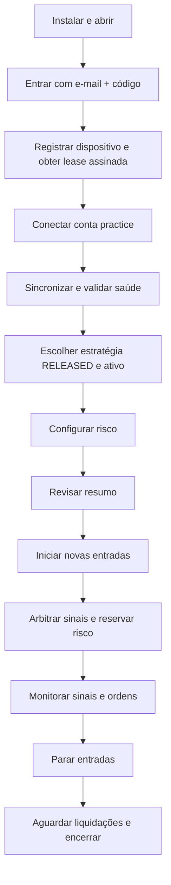

# PRD — Plataforma Desktop de Trading Automatizado para Deriv e IQ Option

**Produto:** Trading Lab Desktop

**Versão do PRD:** 1.9.11

**Status:** baseline executável atual + requisitos-alvo identificados como roadmap

**Atualizado em:** 2026-08-26

**Plataforma inicial:** Windows 10/11 64 bits

**Idioma inicial:** português do Brasil
**Documento técnico relacionado:** `Arquitetura_Resiliente_Trading_Desktop_Deriv_IQOption.md`

## 0. Baseline executável v1.9.11

Esta seção é a fotografia autoritativa do produto entregue. Requisitos posteriores que descrevem
IQ Option operacional, conta Real financeira, identidade remota, instalador ou atualização assinada
são requisitos-alvo e não devem ser interpretados como capacidade disponível.

| Área | Disponível na v1.9.11 |
|---|---|
| Windows desktop | UI PySide6, launcher portátil, instância única e supervisão |
| Deriv pública | ticks, catálogo/diagnóstico e transporte fake-public padrão |
| Deriv autenticada | API Token interno, lista oficial de contas e seleção Demo/Real |
| Deriv Demo | conexão, saldo, ticks, execução das três estratégias e reconciliação |
| Deriv Real | conexão e monitoramento read-only; submissão financeira desabilitada |
| IQ Option | domínio, worker/harnesses e testes; sem login ou execução externa no app |
| Estratégias | Tail Probability Edge, Selective Differs Edge e Parity Regime Edge |
| Risco | ledger, limites, cooldown, filtro de desempenho e Martingale limitado opcional |
| Dados | `state.db` financeiro e `strategy_data.db` de análise |
| Diagnóstico | pacote ZIP local redigido, sem vault, token ou bancos |

A suíte atual coleta 613 testes. Esse número mede cobertura de comportamento e segurança, não
rentabilidade. O nome histórico “DualTrade” permanece em partes do domínio e da documentação;
“Trading Lab Desktop” é o nome exibido na aplicação atual.

## 1. Resumo executivo

O Trading Lab Desktop é um aplicativo Windows que hoje executa estratégias na Deriv Demo e mantém
uma arquitetura preparada para integração independente da IQ Option. Todo o ciclo implementado —
conexão, dados de mercado, estratégia, risco, envio Demo, acompanhamento, recuperação e histórico —
ocorre localmente no computador do cliente.

O produto não prometerá lucro nem apresentará estratégias como garantidas. Sua proposta de valor será oferecer execução disciplinada, controles de risco, transparência operacional e recuperação segura diante de falhas comuns de internet, corretora ou computador.

A v1.9.11 valida execução externa somente na Deriv Demo. A conta Deriv Real pode ser conectada para
leitura, mas não recebe ordens. A integração operacional da IQ Option e qualquer execução Real são
marcos posteriores protegidos por critérios técnicos, jurídicos e de risco.

## 2. Problema

Traders que desejam automatizar estratégias em Deriv e IQ Option encontram um ambiente fragmentado:

- cada corretora possui autenticação, produtos, expirações e mensagens diferentes;
- a integração da IQ Option não possui a mesma estabilidade contratual de uma API oficial;
- bots existentes frequentemente misturam estratégia, risco, conexão e execução no mesmo código;
- falhas de internet podem produzir ordens duplicadas ou desconhecidas;
- martingale ilimitado e promessas de win rate escondem o risco real de ruína;
- o usuário raramente consegue entender por que uma entrada ocorreu ou foi bloqueada;
- soluções dependentes de servidor geram custo, dependência e custódia de credenciais.

O produto precisa automatizar sem transformar uma falha técnica em exposição financeira não controlada.

## 3. Visão do produto

> Ser a plataforma desktop mais transparente e segura para executar estratégias automatizadas em Deriv e IQ Option, mantendo credenciais, decisões e dados operacionais no computador do usuário.

## 4. Proposta de valor

### Para o usuário

- uma única interface para duas corretoras;
- operação local, sem servidor de trading obrigatório;
- conta demo/practice claramente separada de conta real;
- controles de risco independentes da estratégia;
- explicação de cada sinal, entrada e bloqueio;
- recuperação após quedas sem reenvio cego;
- histórico e relatórios locais;
- botão seguro para interromper novas entradas.

### Para o negócio

- núcleo compartilhado entre corretoras;
- integração IQ isolada e substituível;
- estratégias plugáveis;
- suporte baseado em logs redigidos e diagnósticos reproduzíveis;
- identidade, licenciamento, dispositivos e catálogo de estratégias podem usar um plano de controle remoto mínimo sem hospedar execução de trades;
- possibilidade de atualizações assinadas sem custodiar credenciais de corretora ou estado financeiro.

## 5. Público-alvo

### Persona primária — trader individual disciplinado

- utiliza Windows;
- já possui conta na Deriv ou IQ Option;
- entende que trading envolve perda financeira;
- deseja automatizar regras que hoje executa manualmente;
- quer limitar stake, perdas e quantidade de operações;
- aceita iniciar em demo/practice antes de conta real.

### Persona secundária — operador técnico/estrategista

- deseja comparar o comportamento da mesma estratégia nas duas corretoras;
- precisa de replay, logs e exportação para avaliar resultados;
- quer criar ou configurar estratégias sem alterar a integração da corretora.

### Não é público-alvo inicial

- gestor de contas de terceiros;
- mesa institucional;
- usuário que espera renda garantida;
- usuário que deseja martingale ilimitado;
- operação em nuvem ou múltiplos computadores sincronizados;
- revenda de sinais ou copy trading.

## 6. Jobs to be Done

1. Quando eu quiser automatizar uma estratégia, quero configurá-la com limites claros para não depender de execução emocional.
2. Quando conectar uma corretora, quero saber se dados, relógio, payout e conta estão realmente prontos antes de operar.
3. Quando uma entrada for bloqueada, quero ver o motivo exato.
4. Quando a internet ou API falhar, quero que o sistema preserve o estado e não duplique operações.
5. Quando reiniciar o computador, quero que o bot reconcilie ordens pendentes antes de voltar a operar.
6. Quando comparar estratégias, quero métricas separadas por corretora, ativo, produto e versão.
7. Quando parar o bot, quero impedir novas entradas sem perder o acompanhamento das operações já abertas.

## 7. Objetivos

### Objetivos entregues na baseline v1.9.11

- suportar Deriv Demo com execução financeira externa e Deriv Real read-only;
- manter a IQ Option isolada no domínio e em testes, ainda sem integração operacional na UI;
- suportar catálogo versionado e execução das três estratégias Digit Edge;
- incluir Tail Probability Edge, Selective Differs Edge e Parity Regime Edge, sem tratá-las como estratégias comprovadamente lucrativas;
- executar estratégias de um tick com manifesto versionado e estado isolado;
- manter uma única ordem Deriv em voo;
- aplicar stake fixa ou Martingale opcional delimitado por etapas, multiplicador, stake máxima e stop loss;
- bloquear entradas quando saúde, risco ou dados não forem confiáveis;
- registrar sinais, bloqueios, ordens, resultados e incidentes;
- recuperar com segurança após crash, queda de internet ou suspensão do Windows;
- gerar pacote de diagnóstico local redigido;
- proteger a credencial Deriv com Windows DPAPI e manter o App ID público interno;
- iniciar sempre desarmado e exigir ação explícita do operador para novas entradas.

### Objetivos da versão 1.0 comercial

- produzir instalador reproduzível e binários assinados para Windows;
- ativar identidade/licenciamento remoto apenas se o modelo comercial exigir;
- habilitar conta real com fluxo de confirmação e critérios mínimos;
- oferecer atualização assinada e reversível;
- disponibilizar pacote de diagnóstico redigido;
- suportar estratégias compartilhadas e específicas por corretora;
- manter operação de uma corretora quando a outra estiver indisponível;
- permitir limites globais considerando as duas contas.

## 8. Não objetivos

- garantir rentabilidade ou taxa mínima de acerto;
- ocultar perdas ou drawdown;
- replicar toda a interface das corretoras;
- permitir saque ou depósito;
- custodiar dinheiro ou credenciais em servidor próprio;
- fazer copy trading, social trading ou gestão de contas de terceiros;
- suportar macOS, Linux ou mobile no lançamento;
- executar martingale ilimitado;
- reenviar automaticamente uma ordem com resultado de envio desconhecido;
- continuar operando quando o banco local, relógio ou dados estiverem inconsistentes.

## 9. Premissas de produto

| ID | Premissa |
|---|---|
| A-01 | O produto será distribuído como aplicativo Windows local. |
| A-02 | O alvo continua multi-corretora, com integrações independentes; somente a Deriv está operacional externamente na v1.9.11. |
| A-03 | A execução não dependerá de servidor próprio. |
| A-04 | Um plano de controle remoto mínimo PODE ser usado para identidade, dispositivos, assinatura/entitlements, catálogo/compatibilidade, atualização e telemetria consentida; ele NÃO executa trades nem recebe credenciais de corretora. |
| A-05 | A v1.9.11 envia ordens somente à Deriv Demo; Deriv Real é read-only e IQ Option externa permanece planejada. |
| A-06 | A primeira estratégia compartilhada utilizará candles fechados e parâmetros versionados. |
| A-07 | Martingale, quando habilitado, deve ser estritamente delimitado (teto de etapas, multiplicador e stop loss financeiro); martingale ilimitado é proibido. |
| A-08 | O usuário é responsável por possuir e utilizar contas elegíveis nas corretoras. |
| A-09 | O aplicativo deverá interromper entradas diante de incerteza operacional. |
| A-10 | Credenciais nunca serão enviadas para infraestrutura do produto. |

## 10. Princípios de experiência

1. **Segurança visível:** a UI mostra conta, modo, risco e saúde o tempo todo.
2. **Bloqueio explicável:** todo bloqueio possui código e mensagem compreensível.
3. **Demo primeiro:** o caminho padrão nunca conduz acidentalmente a conta real.
4. **Controle sem ilusão:** não mostrar “confiança” como probabilidade sem calibração comprovada.
5. **Parada segura:** “parar” bloqueia novas entradas e continua acompanhando operações abertas.
6. **Separação por corretora:** falha da IQ não deve esconder ou derrubar o estado da Deriv.
7. **Configuração conservadora:** padrões priorizam sobrevivência operacional e financeira.

## 11. Escopo por versão

### MVP — validação operacional

Nesta seção, “Incluído” representa o escopo de produto originalmente definido. O estado realizado
de cada item deve ser conferido na seção 0; itens IQ Option, identidade remota, instalador e conta
Real financeira continuam roadmap.

Incluído:

- onboarding e aviso de risco;
- perfis locais;
- conexão Deriv demo;
- conexão IQ Option practice;
- painel de saúde por corretora;
- catálogo dinâmico de ativos/produtos;
- catálogo local de estratégias candidatas e Strategy Runtime;
- Signal Arbiter e Portfolio Allocator antes do Risk Ledger;
- estratégia(s) liberada(s) somente após validação e status compatível;
- stake fixa, percentual e gestão delimitada (Bounded Martingale com teto de etapas e stop loss);
- stop diário, limite de perdas consecutivas e limite de operações;
- uma operação simultânea por conta;
- modo simulado, demo/practice;
- journal e histórico;
- reconciliação automática e revisão manual;
- exportação CSV;
- logs e pacote de diagnóstico local;
- instalador de teste;
- login do produto por e-mail + código de seis dígitos;
- Auth Agent com PKCE, token vault, dispositivo registrado e lease assinada;
- renovação silenciosa e funcionamento offline dentro da validade da lease.

Não incluído:

- conta real;
- martingale ilimitado;
- múltiplas estratégias simultâneas por conta;
- marketplace de estratégias;
- sincronização entre computadores;
- atualização automática silenciosa;
- licença paga.

### Beta controlado

- conta real protegida por feature flag;
- confirmação reforçada;
- limites conservadores obrigatórios;
- atualização assinada;
- uma pequena lista de estratégias aprovadas;
- diagnóstico aprimorado;
- operação simultânea entre corretoras com risco global.

### Versão 1.0

- conta real disponível quando legal e tecnicamente aplicável;
- estratégias compartilhadas e exclusivas;
- backtest/replay integrado;
- relatórios consolidados;
- atualizações com rollback;
- identidade, dispositivos, licenciamento e entitlements gerenciados;
- telemetria de falhas somente com consentimento.

## 12. Jornada principal

## 13. Jornadas detalhadas

### 13.1 Primeiro acesso

1. Usuário abre o aplicativo e visualiza o resumo de risco e a ausência de promessa de lucro.
2. Informa apenas o e-mail do produto.
3. Recebe e informa um código de seis dígitos.
4. O fluxo de autenticação usa o navegador do sistema/Authorization Code + PKCE quando aplicável ao provedor, sem `client_secret` confiável no executável.
5. O backend resolve/cria um `user_id` estável; o aplicativo cria um `device_id` aleatório e um par de chaves do dispositivo.
6. Refresh token, chave privada do dispositivo e lease ficam protegidos no escopo do usuário do Windows.
7. O servidor emite uma lease assinada vinculada a usuário, dispositivo, plano, brokers, strategy packs, modo real e compatibilidade.
8. Nas próximas aberturas, o aplicativo tenta renovação silenciosa e só solicita novo código em situações de reautenticação.
9. Usuário define preferências locais e escolhe conectar Deriv, IQ Option ou ambas.
10. O produto mantém demo/practice como padrão e impede conta real no MVP.

### 13.2 Conectar Deriv

1. Usuário escolhe conectar Deriv.
2. Para distribuição comercial, o fluxo principal usa autorização OAuth da Deriv no navegador; PAT pode existir apenas em protótipo/desenvolvimento explicitamente permitido.
3. Credencial/token da Deriv permanece separado da identidade DualTrade e nunca é enviado ao serviço de identidade do produto.
4. Aplicativo valida autenticação e escopos.
5. Core sincroniza conta, relógio, catálogo e saldo.
6. Health Gate mostra cada verificação.
7. A conta só fica `READY` depois da sincronização completa.

### 13.3 Conectar IQ Option

1. Usuário informa credenciais na tela segura específica da corretora.
2. Autenticação ocorre exclusivamente no IQ Option Worker; e-mail/senha, cookies e sessão não passam pelo serviço de identidade DualTrade.
3. Armazenamento de credencial é opcional; quando habilitado, usa proteção no escopo do usuário do Windows.
4. Se houver desafio adicional, a UI solicita a interação necessária sem registrar o conteúdo.
5. Core confirma conta practice, relógio, catálogo e saldo.
6. Falhas repetidas acionam circuit breaker e orientação, não loop infinito.

### 13.4 Configurar estratégia

1. Usuário escolhe corretora, produto e ativo.
2. Strategy Catalog local filtra versões por manifesto, compatibilidade, entitlement e `release_status`.
3. UI exibe somente estratégias permitidas e compatíveis.
4. Usuário define parâmetros dentro do schema e limites válidos.
5. Usuário define stake e limites de risco; a estratégia não escolhe a stake final.
6. Produto exibe uma revisão completa antes de iniciar.
7. Configuração recebe versão imutável durante a execução.
8. Cada instância de runtime fica isolada por estratégia + versão + broker + conta + produto + ativo + timeframe.

### 13.5 Operação normal

1. Worker recebe dados.
2. Core valida origem, tempo, sequência e qualidade.
3. Cada Strategy Runtime elegível avalia candle fechado e produz sinal com validade/evidência.
4. Signal Arbiter resolve conflitos; sinais opostos no mesmo contexto geram nenhuma entrada no MVP e sinais iguais não somam stake.
5. Portfolio Allocator aplica o orçamento permitido por estratégia/conta/global.
6. Sinal arbitrado solicita cotação.
7. Risk Ledger autoriza e reserva exposição.
8. Intenção, reserva e outbox são persistidas atomicamente.
9. Worker envia ordem dentro do deadline.
10. UI exibe aceite, abertura e liquidação.
11. Histórico registra estratégia/versão, arbitragem, justificativa e latências.

### 13.6 Falha ou timeout

1. Core bloqueia novas entradas da conta afetada.
2. Ordem potencialmente enviada vira `UNKNOWN`.
3. Worker reconecta com backoff.
4. Recovery Coordinator consulta conta e histórico.
5. Estado é reconciliado ou enviado para revisão manual.
6. Conta só retorna a `READY` quando não houver ambiguidade relevante.

### 13.7 Parar e encerrar

1. Usuário seleciona “Parar novas entradas”.
2. Produto cancela sinais e comandos ainda não enviados.
3. Continua acompanhando operações abertas.
4. Depois da liquidação e persistência, permite encerramento seguro.

## 14. Requisitos funcionais

Prioridades: **P0** obrigatório para o MVP; **P1** obrigatório para beta; **P2** posterior.

### 14.1 Instalação e perfil

| ID | Pri. | Requisito | Critério de aceite resumido |
|---|---:|---|---|
| FR-001 | P0 | Instalar no Windows 10/11 64 bits | Instalação e desinstalação passam em VM limpa. |
| FR-002 | P0 | Garantir uma instância por perfil | Segunda abertura direciona para a instância existente e não cria outro Core. |
| FR-003 | P0 | Criar perfil local | Preferências são restauradas sem conter credenciais em texto puro. |
| FR-004 | P1 | Atualizar com assinatura e rollback | Pacote adulterado é rejeitado; falha de health check restaura versão anterior. |

Na implementação atual, `profile.lock`, mutex nativo e o lock próprio do Core impedem dois writers.
Uma segunda abertura do executável portátil traz a janela existente para frente em vez de iniciar
outro Core.

### 14.2 Contas e autenticação

| ID | Pri. | Requisito | Critério de aceite resumido |
|---|---:|---|---|
| FR-010 | P0 | Conectar conta demo Deriv | Conta, saldo, moeda e modo são confirmados antes de `READY`. |
| FR-011 | P1 | Conectar conta practice IQ Option | Planejado: conta, saldo, moeda e modo são confirmados antes de `READY`. |
| FR-012 | P0 | Desconectar uma corretora sem afetar a outra | Deriv continua saudável quando IQ é desconectada e vice-versa. |
| FR-013 | P0 | Remover credenciais locais | Após remoção, nova conexão exige autenticação novamente. |
| FR-014 | P0 | Impedir troca silenciosa de practice para real | Mudança de modo força bloqueio, reconciliação e confirmação. |
| FR-015 | P1 | Habilitar conta real controladamente | A conexão read-only exige confirmação explícita; envio financeiro continua bloqueado até todos os gates serem aprovados. |

### 14.3 Saúde e capacidades

| ID | Pri. | Requisito | Critério de aceite resumido |
|---|---:|---|---|
| FR-020 | P0 | Exibir estado por corretora | UI mostra conexão, conta, relógio, dados, catálogo e reconciliação. |
| FR-021 | P0 | Carregar catálogo dinâmico | Apenas ativos, produtos e expirações atualmente válidos aparecem. |
| FR-022 | P0 | Monitorar heartbeat e relógio | Limite excedido muda estado para `DEGRADED` e bloqueia entrada. |
| FR-023 | P0 | Validar qualidade dos dados | Gap, atraso ou candle incompleto impedem geração de entrada. |
| FR-024 | P0 | Aplicar circuit breaker | Falhas repetidas suspendem reconexões rápidas e exibem orientação. |

### 14.4 Estratégias

| ID | Pri. | Requisito | Critério de aceite resumido |
|---|---:|---|---|
| FR-030 | P0 | Registrar estratégias por manifesto | Estratégia incompatível não pode ser selecionada. |
| FR-031 | P0 | Isolar estado por contexto | Buffers nunca misturam broker, conta, produto, ativo ou timeframe. |
| FR-032 | P0 | Executar estratégia inicial compartilhada | Mesmo código puro funciona em replay e nos dois modos practice. |
| FR-033 | P0 | Versionar parâmetros | Alteração cria nova configuração e não modifica execução ativa silenciosamente. |
| FR-034 | P0 | Explicar sinais | Cada sinal registra ação, evidências, evento de mercado e validade. |
| FR-035 | P1 | Adicionar estratégias específicas Deriv | Estratégias de produto exclusivo só aparecem quando suportadas. |
| FR-036 | P1 | Adicionar estratégias específicas IQ | Recursos exclusivos só aparecem no contexto IQ compatível. |

### 14.5 Risco

| ID | Pri. | Requisito | Critério de aceite resumido |
|---|---:|---|---|
| FR-040 | P0 | Configurar stake fixa | Valor respeita mínimos, máximos, moeda e saldo disponível. |
| FR-041 | P0 | Configurar stake percentual | Cálculo usa saldo confirmado e arredondamento conservador. |
| FR-042 | P0 | Aplicar stop diário | Ao atingir limite, novas entradas ficam bloqueadas até o próximo período operacional definido. |
| FR-043 | P0 | Limitar perdas consecutivas | Ao atingir limite, estratégia entra em cooldown/bloqueio. |
| FR-044 | P0 | Limitar número de operações | Ordens abertas, reservadas e desconhecidas são consideradas. |
| FR-045 | P0 | Reservar risco atomicamente | Duas solicitações simultâneas nunca ultrapassam o limite. |
| FR-046 | P0 | Tratar ordem desconhecida como exposição | Reserva só é liberada após reconciliação ou revisão auditada. |
| FR-047 | P1 | Aplicar risco global entre corretoras | Exposição conjunta respeita limite consolidado e moeda de referência. |
| FR-048 | P1 | Detectar exposição correlacionada | Mesmo ativo nas duas corretoras pode receber limite adicional. |

### 14.6 Cotação e execução

| ID | Pri. | Requisito | Critério de aceite resumido |
|---|---:|---|---|
| FR-050 | P0 | Obter cotação antes da reserva | Cotação inclui validade, payout/payoff e deadline quando disponíveis. |
| FR-051 | P0 | Revalidar antes do envio | Comando vencido é rejeitado localmente e nunca enviado. |
| FR-052 | P0 | Persistir antes de enviar | Intenção, reserva e outbox são confirmadas na mesma transação. |
| FR-053 | P0 | Serializar comandos por conta | Apenas um comando financeiro entra no caminho crítico por vez. |
| FR-054 | P0 | Não repetir ordem ambígua | Timeout após possível envio produz `UNKNOWN`, sem retry automático. |
| FR-055 | P0 | Acompanhar liquidação | Resultado atualiza ordem, ledger e P&L atomicamente. |
| FR-056 | P0 | Priorizar eventos financeiros | Confirmação e liquidação não ficam atrás de backlog de ticks/UI. |

### 14.7 Recuperação

| ID | Pri. | Requisito | Critério de aceite resumido |
|---|---:|---|---|
| FR-060 | P0 | Reconectar com backoff e jitter | Falha não produz loop rápido de login ou chamadas. |
| FR-061 | P0 | Entrar em reconciliação após reinício | Conta não retorna a `READY` enquanto existirem estados não terminais. |
| FR-062 | P0 | Reconciliar saldo, posições e histórico | Divergência bloqueia entradas e gera incidente. |
| FR-063 | P0 | Suportar revisão manual | Usuário pode resolver caso irrecuperável com justificativa auditada. |
| FR-064 | P0 | Detectar suspensão do Windows | Retorno invalida cotações e exige sincronização. |

### 14.8 Interface e controle

| ID | Pri. | Requisito | Critério de aceite resumido |
|---|---:|---|---|
| FR-070 | P0 | Dashboard operacional | Exibe modo, corretoras, saldo, P&L, risco, ordens e saúde. |
| FR-071 | P0 | Mostrar último sinal e bloqueio | Usuário vê justificativa e horário de cada evento. |
| FR-072 | P0 | Parar novas entradas | Ação é imediata e preserva acompanhamento de ordens abertas. |
| FR-073 | P0 | Encerrar com segurança | UI informa pendências e não força encerramento silencioso. |
| FR-074 | P0 | Destacar conta real | Modo real utiliza cor, texto e confirmação não confundíveis com practice. |
| FR-075 | P1 | Oferecer acessibilidade básica | Navegação por teclado, contraste e escala do Windows funcionam nas telas principais. |

**Implementação atual da UI:** `apps/ui` usa PySide6/Qt 6 e um controller testável, conectado ao
serviço loopback autenticado do Core. A navegação separa Visão geral, Deriv, IQ Option, Atividade e
Configurações. Na área Deriv, o usuário conecta por token, seleciona conta, escolhe estratégia,
configura risco, arma/pausa o bot e acompanha ticks, ordens e resultados em tempo real.
`UI_SAFE_STOP_COMMAND` acrescenta `HG_SAFE_STOP` sem interromper event pump, reconciliação ou
settlement. Ao retomar ou trocar estratégia, o motor exige um sinal novo. Fechamento seguro
sinaliza o Launcher; falha da UI degrada apenas a projeção e o Core permanece autoritativo.

### 14.9 Histórico e diagnóstico

| ID | Pri. | Requisito | Critério de aceite resumido |
|---|---:|---|---|
| FR-080 | P0 | Registrar trilha de auditoria | Toda transição financeira registra origem, correlação e estado anterior/novo. |
| FR-081 | P0 | Consultar histórico | Filtros por período, corretora, ativo, estratégia, resultado e estado. |
| FR-082 | P0 | Exportar CSV | Exportação preserva valores, moeda, timestamps e IDs sem credenciais. |
| FR-083 | P0 | Gerar pacote de diagnóstico | Pacote contém versões e logs redigidos, nunca segredos. |
| FR-084 | P1 | Exportar relatório consolidado | Relatório compara corretoras sem misturar produtos incompatíveis. |

### 14.10 Identidade, dispositivos e licenciamento

| ID | Pri. | Requisito | Critério de aceite resumido |
|---|---:|---|---|
| FR-090 | P0 | Login único do produto por e-mail + código de seis dígitos | Usuário não precisa criar senha, digitar `user_id`, token ou chave de licença. |
| FR-091 | P0 | Usar `user_id` estável internamente | Mudança de e-mail não altera a identidade interna nem relacionamentos do usuário. |
| FR-092 | P0 | Tratar desktop como cliente público | Nenhum `client_secret` confiável é embutido; fluxo suportado usa Authorization Code + PKCE quando aplicável. |
| FR-093 | P0 | Emitir access token curto e refresh token rotativo | Renovação ocorre sem senha; reutilização indevida pode revogar a família de refresh tokens. |
| FR-094 | P0 | Registrar dispositivo sem fingerprint de hardware | `device_id` é aleatório, possui chave própria e não depende de serial de disco/MAC para autenticar. |
| FR-095 | P0 | Proteger material local de autenticação | Refresh token, chave privada do dispositivo e lease usam proteção vinculada ao usuário do Windows. |
| FR-096 | P0 | Emitir lease offline assinada | Assinatura inválida, adulteração de entitlement ou incompatibilidade bloqueiam novas entradas. |
| FR-097 | P0 | Renovar silenciosamente e tolerar indisponibilidade do serviço | Lease practice válida continua por até 7 dias; expirada bloqueia novas entradas sem abandonar ordens abertas. |
| FR-098 | P1 | Aplicar política reforçada para modo real | Quando real for autorizado, lease real dura no máximo 24 horas e novo dispositivo/modo real exige autenticação reforçada definida pela política. |
| FR-099 | P0 | Minimizar dados do serviço de identidade | Serviço não recebe credenciais de broker, ordens, saldo ou histórico completo de trading. |

### 14.11 Plataforma multi-estratégias

| ID | Pri. | Requisito | Critério de aceite resumido |
|---|---:|---|---|
| FR-100 | P0 | Manter Strategy Catalog versionado | Cada estratégia possui `strategy_id`, versão, hash, compatibilidade, requisitos de dados e status. |
| FR-101 | P0 | Validar manifesto antes de carregar | Broker/produto/timeframe/dados incompatíveis impedem seleção e execução. |
| FR-102 | P0 | Isolar Strategy Runtime por contexto completo | Estado nunca é compartilhado entre versão, broker, conta, produto, ativo ou timeframe. |
| FR-103 | P0 | Aplicar ciclo de vida de validação | `DRAFT` não pode virar `RELEASED` sem backtest, walk-forward, replay e practice conforme política. |
| FR-104 | P0 | Executar Signal Arbiter antes do risco | Sinais opostos no mesmo contexto produzem nenhuma entrada no MVP. |
| FR-105 | P0 | Não somar stake de sinais coincidentes | Sinais iguais geram no máximo uma intenção para o contexto arbitrado. |
| FR-106 | P0 | Aplicar Portfolio Allocator | Orçamento por estratégia, conta e global é respeitado antes do Risk Ledger. |
| FR-107 | P0 | Registrar evidência de validação por versão | Resultados distinguem broker, produto, ativo, timeframe, regime e prática/replay. |
| FR-108 | P0 | Distribuir somente código confiável no MVP | Estratégias vêm compiladas/empacotadas com a aplicação; Python arbitrário baixado não é executado. |
| FR-109 | P1 | Suportar pacotes assinados e entitlement | Pacote remoto adulterado, não autorizado, suspenso ou incompatível é rejeitado. |
| FR-110 | P0 | Suspender estratégia sem abandonar operação existente | `SUSPENDED` impede novas entradas e mantém acompanhamento das ordens abertas. |
| FR-111 | P0 | Manter estratégias atuais separadas de promessa de resultado | Tail Probability Edge, Selective Differs Edge e Parity Regime Edge são experimentais, não garantias de rentabilidade. |
| FR-112 | P0 | Permitir seleção explícita de N estratégias Digit Edge | Todas continuam em análise shadow; somente as habilitadas disputam, por arbitragem determinística, o único slot de ordem da conta. |
| FR-113 | P0 | Isolar o motor de ticks por símbolo | Cada `(broker, símbolo)` possui buffer e warm-up próprios, limitados a 12 engines; tick estrangeiro falha explicitamente. |

## 15. Regras de negócio

| ID | Regra |
|---|---|
| BR-001 | Apenas sessão `READY` pode iniciar nova operação. |
| BR-002 | `DEGRADED`, `RECONCILING` e `RISK_LOCKED` acompanham operações, mas não abrem novas. |
| BR-003 | Uma ordem `UNKNOWN` mantém exposição reservada pelo pior caso configurado. |
| BR-004 | Ordem não é reenviada automaticamente após timeout de submissão. |
| BR-005 | Candle em formação não gera entrada na estratégia inicial. |
| BR-006 | Sinal vencido não pode solicitar nova ordem. |
| BR-007 | Payout/payoff abaixo do limite configurado bloqueia a entrada. |
| BR-008 | Alteração de estratégia ou risco durante execução cria uma nova versão. |
| BR-009 | Falha de persistência bloqueia imediatamente novas entradas. |
| BR-010 | Falha de uma corretora não bloqueia a outra, salvo quando o limite global ficar incerto. |
| BR-011 | Conta real nunca é selecionada por padrão. |
| BR-012 | Martingale deve ser estritamente delimitado por etapas máximas (max_steps), teto de stake e stop loss financeiro; martingale sem limite é proibido. |
| BR-013 | Valores financeiros usam moeda explícita e precisão decimal. |
| BR-014 | “Parar” significa bloquear entradas; não significa eliminar contratos já abertos. |
| BR-015 | O cliente vê um único login do produto por e-mail + código; identidades e tokens internos não são credenciais manuais. |
| BR-016 | Expiração/revogação de licença ou entitlement bloqueia novas entradas, mas não interrompe monitoramento/liquidação de contratos abertos. |
| BR-017 | O serviço de identidade nunca recebe senha/cookie/token das corretoras nem estado financeiro operacional completo. |
| BR-018 | Device ID é aleatório e chaveado; hardware fingerprint não é fator autenticador principal. |
| BR-019 | Estratégia só executa quando manifesto, hash, compatibilidade, entitlement e status permitem. |
| BR-020 | Signal Arbiter precede Portfolio Allocator e Risk Ledger. |
| BR-021 | Sinais opostos no mesmo contexto cancelam a entrada no MVP; sinais iguais não multiplicam stake. |
| BR-022 | Modo estresse com todas as estratégias habilitadas é exclusivo da conta Demo; conta Real continua sem submissão financeira. |
| BR-023 | Seleção vazia falha fechada e nenhuma mudança de seleção altera ordem já em voo. |

## 16. Telas do produto

### 16.1 Onboarding

- login do produto por e-mail + código de seis dígitos;
- ativação/estado do dispositivo e licença sem expor IDs/tokens internos;
- propósito e limitações;
- aviso de risco;
- seleção de perfil;
- escolha inicial de corretora;
- indicação clara de demo/practice.

### 16.2 Central de corretoras

- cartões separados Deriv e IQ Option;
- estado de conexão;
- tipo de conta;
- saldo e moeda;
- worker/protocolo compatível;
- relógio, dados e reconciliação;
- conectar, desconectar e remover credenciais.

### 16.3 Configuração da estratégia

- corretora e conta;
- produto e ativo;
- estratégia compatível;
- parâmetros;
- timeframe e expiração válidos;
- modelo de stake (fixa, percentual ou Bounded Martingale com multiplicador, teto de etapas e projeção de drawdown da sequência);
- limites de risco e stop loss diário;
- resumo e validações.

### 16.4 Dashboard

- status global;
- status por corretora;
- modo simulado/practice/real;
- P&L diário;
- exposição reservada e aberta;
- perdas consecutivas;
- contagem de operações;
- último sinal;
- último bloqueio;
- ordens abertas e desconhecidas;
- controles “Parar entradas” e “Encerrar com segurança”.

### 16.5 Histórico

- sinais;
- operações;
- liquidações;
- bloqueios de risco;
- incidentes;
- filtros e exportação.

### 16.6 Recuperação

- estado anterior;
- evidências encontradas na corretora;
- saldo antes/depois;
- decisão automática ou pendência;
- orientação de revisão manual;
- registro de justificativa.

### 16.7 Diagnóstico e atualização

- versões;
- saúde dos processos;
- integridade do armazenamento;
- gerar pacote de suporte;
- verificar atualização;
- status de assinatura e possibilidade de rollback.

## 17. Requisitos não funcionais

### 17.1 Confiabilidade

| ID | Requisito mensurável |
|---|---|
| NFR-001 | Zero reenvios automáticos de ordem após timeout ambíguo. |
| NFR-002 | 100% das intenções enviadas possuem registro durável anterior ao envio. |
| NFR-003 | 100% dos estados não terminais são reconciliados ou bloqueados após reinício. |
| NFR-004 | Falha isolada de worker não encerra Core, UI ou outro worker. |
| NFR-005 | Falha de persistência impede novas entradas em até 1 segundo após detecção. |

### 17.2 Desempenho

| ID | Requisito mensurável |
|---|---|
| NFR-010 | Evento financeiro interno P95 processado pelo Core em até 100 ms, excluindo latência da corretora. |
| NFR-011 | Atualização do dashboard P95 em até 500 ms, podendo agregar ticks. |
| NFR-012 | Nenhuma fila em memória cresce sem limite. |
| NFR-013 | Backlog de UI nunca bloqueia prioridade financeira. |
| NFR-014 | Inicialização normal até dashboard utilizável em até 15 segundos em máquina suportada. |

### 17.3 Recuperação

| ID | Requisito mensurável |
|---|---|
| NFR-020 | Worker travado é detectado dentro do limite configurado de heartbeat. |
| NFR-021 | Reinício do Core nunca retorna automaticamente a `READY` antes de sincronização. |
| NFR-022 | Atualização falha reverte para última versão funcional. |
| NFR-023 | Banco crítico possui verificação de integridade e backup consistente. |

### 17.4 Segurança e privacidade

| ID | Requisito mensurável |
|---|---|
| NFR-030 | Nenhuma senha/token aparece em logs, exportações ou pacote de diagnóstico. |
| NFR-031 | Credenciais persistidas usam proteção vinculada ao usuário do Windows. |
| NFR-032 | Atualização e executáveis são verificados antes de executar. |
| NFR-033 | IPC da UI não aceita outro usuário do Windows. |
| NFR-034 | Telemetria remota é desativada por padrão até consentimento explícito. |
| NFR-035 | Nenhum `client_secret` confiável existe no executável desktop. |
| NFR-036 | Material de autenticação local sensível usa proteção no escopo do usuário do Windows. |
| NFR-037 | Indisponibilidade do serviço de identidade com lease válida não interrompe acompanhamento de ordens abertas. |
| NFR-038 | Serviço de identidade não persiste credenciais de corretora nem histórico completo de trading. |

### 17.5 Compatibilidade e manutenção

| ID | Requisito mensurável |
|---|---|
| NFR-040 | Core e workers negociam versão de protocolo antes da autenticação. |
| NFR-041 | Dependências específicas da IQ não são carregadas pelo Core ou worker Deriv. |
| NFR-042 | Migrações são transacionais e possuem teste de upgrade/rollback suportado. |
| NFR-043 | Build é reproduzível a partir de dependências fixadas. |
| NFR-044 | Estratégias/pacotes são carregados somente quando hash, manifesto, status e assinatura/entitlement aplicáveis forem válidos. |

## 18. Métricas de produto

### North Star operacional

**Percentual de sessões practice concluídas sem incidente não reconciliado.**

Essa métrica avalia se o produto consegue operar e recuperar com confiança; não mede rentabilidade.

### Métricas principais

- taxa de onboarding concluído;
- taxa de conexão bem-sucedida por corretora;
- percentual de tempo em `READY`, `DEGRADED` e `RISK_LOCKED`;
- sinais gerados versus bloqueados;
- distribuição dos motivos de bloqueio;
- ordens aceitas, rejeitadas, desconhecidas e reconciliadas;
- tempo médio e P95 de reconciliação;
- divergência entre replay e practice;
- sessões encerradas com segurança;
- crashes por 100 horas de execução;
- falhas de atualização/rollback;
- pacotes de diagnóstico que passam na verificação de ausência de segredos.

### Métricas que não serão usadas isoladamente

- win rate;
- lucro absoluto;
- número bruto de trades;
- “confiança” declarada pela estratégia.

Essas métricas podem incentivar risco excessivo e não demonstram qualidade do produto.

## 19. Eventos de analytics locais

| Evento | Campos mínimos |
|---|---|
| `app_started` | versão, resultado da integridade, modo |
| `broker_connect_result` | broker, modo, sucesso, código de erro |
| `health_state_changed` | broker, estado anterior, novo, motivo |
| `strategy_run_started` | estratégia/versão, broker, produto, sem parâmetros sensíveis |
| `signal_created` | estratégia, ação, validade |
| `signal_blocked` | código do gate, broker, estratégia |
| `order_state_changed` | broker, estado anterior/novo, latência |
| `reconciliation_completed` | broker, resultado, duração |
| `safe_stop_requested` | operações pendentes, duração até conclusão |
| `diagnostic_bundle_created` | versão, verificações de redação |
| `auth_state_changed` | estado anterior/novo, motivo, sem e-mail completo/token/código |
| `license_state_changed` | validade, entitlement, motivo, sem conteúdo assinado bruto |
| `strategy_arbitrated` | estratégias/versões, contexto, decisão do arbiter |

Eventos permanecem locais no MVP. Qualquer envio futuro exige consentimento e política de retenção.

## 20. Dados e retenção

### Dados críticos

- contas sem segredo;
- configurações versionadas;
- sinais;
- decisões de risco;
- intenções;
- ordens;
- liquidações;
- incidentes;
- auditoria;
- `user_id`, `device_id`, plano/entitlements e metadados de lease necessários ao gate, sem armazenar refresh token em claro.

### Dados de mercado

- candles;
- ticks selecionados;
- payouts/payoffs observados;
- eventos brutos redigidos;
- datasets de replay.

Dados críticos e dados volumosos ficam separados. A exclusão de histórico deve preservar itens necessários para reconciliar operações e explicar decisões.

## 21. Segurança operacional

- nenhuma função de saque ou depósito;
- nenhum envio de credenciais para servidor próprio;
- nenhum plugin de estratégia executa código arbitrário no MVP;
- nenhuma estratégia altera Risk Ledger;
- nenhuma conta opera com worker incompatível;
- nenhuma atualização acontece durante ordem ambígua;
- modo real requer confirmação por sessão ou período configurado;
- pacote de diagnóstico passa por redator e scanner de segredos;
- cliente desktop não contém `client_secret` confiável;
- refresh token, chave privada do dispositivo e lease são protegidos no escopo do usuário do Windows;
- estratégias executáveis exigem proveniência/versionamento e não baixam Python arbitrário no MVP.

## 22. Riscos do produto

| Risco | Prob. | Impacto | Mitigação |
|---|---:|---:|---|
| Mudança na integração IQ Option | Alta | Crítico | worker isolado, circuit breaker, fixtures, atualização independente |
| Ordem aceita sem confirmação | Média | Crítico | `UNKNOWN`, reserva conservadora e reconciliação |
| Usuário confundir practice e real | Média | Crítico | distinção visual, confirmação e real fora do MVP |
| Estratégia sem vantagem estatística | Alta | Alto | replay, practice, métricas e ausência de promessa |
| Internet/Windows instável | Alta | Alto | clock monitor, suspensão detectada, reconciliação |
| Vazamento de credenciais | Baixa/Média | Crítico | proteção do Windows, redação, dependências isoladas |
| Serviço de identidade indisponível | Média | Alto | lease offline assinada, renovação silenciosa e bloqueio somente de novas entradas após expiração |
| Compartilhamento/roubo de sessão | Média | Alto | device key, limite/revogação de dispositivos, refresh rotation e reautenticação |
| Estratégia adulterada ou incompatível | Baixa/Média | Crítico | manifesto, hash, assinatura, entitlement, status e fail closed |
| Antivírus bloquear executável | Média | Alto | assinatura, onedir, VM limpa, diagnóstico |
| Banco local indisponível | Baixa | Crítico | single writer, integridade, backup e fail closed |
| Exposição duplicada nas duas corretoras | Média | Crítico | ledger global e correlação |
| Restrição regulatória/comercial | Variável | Crítico | revisão jurídica e regras de distribuição antes do lançamento real/comercial |

## 23. Dependências

- disponibilidade da API oficial Deriv;
- funcionamento da integração comunitária IQ Option;
- ambiente Windows suportado;
- acesso do usuário às próprias contas;
- mecanismo local de armazenamento seguro;
- certificado de assinatura de código para distribuição;
- dados suficientes para replay e validação;
- revisão jurídica antes de comercialização e conta real;
- provedor/serviço de identidade com e-mail OTP, PKCE, rotação/revogação de tokens e gerenciamento de dispositivos;
- infraestrutura mínima para assinatura/verificação de leases, entitlements e compatibilidade.

## 24. Estratégia de lançamento

### Etapa 1 — desenvolvimento interno

- workers simulados;
- testes automatizados;
- falhas injetadas;
- nenhum acesso real a corretora necessário no caminho crítico inicial.

### Etapa 2 — alpha practice

- equipe restrita;
- Deriv demo e IQ practice;
- até três estratégias candidatas no catálogo, executando apenas versões aprovadas para a etapa;
- autenticação do produto e dispositivo em ambiente de teste/practice;
- coleta local de divergências e incidentes;
- sem conta real.

### Etapa 3 — beta practice

- grupo pequeno de usuários;
- instalador assinado;
- pacote de diagnóstico;
- atualização controlada;
- critérios operacionais monitorados.

### Etapa 4 — piloto real

- somente após critérios técnicos e jurídicos;
- poucos usuários elegíveis;
- limites conservadores obrigatórios;
- rollout gradual e reversível;
- desligamento automático diante de regressões críticas.

### Etapa 5 — versão 1.0

- disponibilidade definida por região e elegibilidade;
- suporte e ciclo de atualização formalizados;
- documentação pública de risco, privacidade e limitações.

## 25. Critérios de saída do MVP

O MVP pode avançar para beta quando:

- Deriv demo e IQ practice conectam e operam independentemente;
- nenhuma combinação de testes de crash conhecida gera retry automático de ordem ambígua;
- 100% das ordens enviadas têm intenção e reserva persistidas;
- reinício reconcilia todos os estados não terminais;
- segunda instância não opera a mesma conta;
- falha de um worker não interrompe o outro;
- UI pode fechar sem perder acompanhamento;
- dados atrasados, relógio inválido e payout expirado bloqueiam entradas;
- exportações e diagnósticos não contêm credenciais;
- o conjunto completo de testes P0 está aprovado;
- sessões practice longas atendem aos SLOs operacionais definidos;
- não há defeito crítico aberto em autenticação, risco, execução ou reconciliação;
- login por e-mail + código, registro de dispositivo, rotação de sessão e lease assinada passam nos testes P0;
- expiração/revogação bloqueiam novas entradas sem abandonar ordens abertas;
- catálogo, manifesto, ciclo de vida, arbiter e allocator passam nos testes P0.

## 26. Critérios para habilitar conta real

Conta real só poderá ser incluída quando:

1. beta practice cumprir período e volume de validação definidos;
2. não existirem incidentes de duplicidade automática;
3. reconciliação de ambas as corretoras estiver comprovada nos cenários suportados;
4. atualização assinada e rollback estiverem operacionais;
5. pacote de diagnóstico e redação de segredos estiverem validados;
6. limites globais e por conta estiverem ativos;
7. usuário receber informação de risco e confirmação inequívoca;
8. distribuição e uso estiverem revisados juridicamente para o público-alvo;
9. houver mecanismo de desabilitar uma versão incompatível antes de novas entradas;
10. suporte tiver playbooks para `UNKNOWN`, divergência de saldo e falha de autenticação;
11. modo real exigir lease real curta, autenticação reforçada conforme política e entitlement explícito;
12. serviço de identidade/licenciamento estiver testado para indisponibilidade sem interromper liquidação de posições abertas.

## 27. Matriz de rastreabilidade

| Problema | Requisito principal | Evidência de solução |
|---|---|---|
| Ordem duplicada após timeout | FR-052, FR-054 | teste de crash entre envio e resposta |
| Risco ultrapassado por concorrência | FR-045, FR-047 | teste simultâneo de reservas |
| API IQ instável | FR-012, FR-024, NFR-041 | worker isolado e circuit breaker |
| Windows suspenso | FR-064 | teste de suspensão e retorno |
| Dados incorretos | FR-023 | gap/candle incompleto bloqueado |
| Conta real acidental | FR-014, FR-074 | teste de troca de modo |
| Estado perdido no reinício | FR-061, FR-062 | recuperação com ordens não terminais |
| Backlog atrasando liquidação | FR-056, NFR-013 | teste de carga com ticks |
| Credencial em diagnóstico | FR-083, NFR-030 | scanner de segredos |
| Falha do armazenamento | BR-009, NFR-005 | teste de disco cheio/I/O error |
| Login simples sem segredo embutido | FR-090, FR-092, NFR-035 | teste de fluxo OTP/PKCE e inspeção do build |
| Compartilhamento de conta/dispositivo | FR-094, FR-096, FR-098 | registro, limite, revogação e assinatura da lease |
| Serviço de identidade fora do ar | FR-097, NFR-037 | lease válida continua; expirada bloqueia novas entradas |
| Estratégias conflitantes | FR-104, FR-105, BR-021 | teste de sinais CALL/PUT e sinais coincidentes |
| Estratégia adulterada/incompatível | FR-100, FR-101, FR-109, NFR-044 | teste de hash/manifesto/assinatura/entitlement |

## 28. Questões abertas para decisão do produto

Estas decisões não bloqueiam a arquitetura, mas devem ser fechadas antes do beta:

1. Nome comercial e identidade visual.
2. Lista exata de países/regiões de distribuição.
3. Modelo de negócio: licença única, assinatura ou versão gratuita.
4. Política de suporte e tempo de resposta quando a integração IQ quebrar.
5. Se credenciais IQ poderão ser lembradas ou exigidas a cada sessão.
6. Parâmetros e presets finais das três candidatas iniciais, além dos critérios quantitativos de promoção por versão.
7. Período/volume mínimo de practice antes de liberar real.
8. Limites conservadores obrigatórios da primeira versão real.
9. Retenção padrão de histórico e dados de mercado.
10. Telemetria futura: quais eventos, finalidade e consentimento.
11. Frequência e canal de atualização.
12. Política para versões antigas incompatíveis.
13. Provedor gerenciado de identidade/e-mail definitivo e política antifraude do código de seis dígitos.
14. Limite de dispositivos por plano e regras comerciais de recuperação/revogação.
15. Duração operacional final das leases dentro dos tetos de até 7 dias em practice e até 24 horas em real.

## 29. Definição de pronto de uma funcionalidade

Uma funcionalidade é considerada pronta quando:

- possui requisito e critério de aceite identificados;
- tem testes unitários relevantes;
- tem teste de integração com worker simulado;
- trata timeout, cancelamento e restart;
- produz logs com correlação;
- não inclui segredos nos logs;
- atualiza projeções da UI sem acessar diretamente o banco;
- possui comportamento de fail closed definido;
- documentação do usuário foi atualizada;
- passou revisão de segurança quando toca credenciais, ordens ou atualização.

## 30. Glossário

| Termo | Definição |
|---|---|
| Trading Core | Processo central e única autoridade sobre estado financeiro local. |
| Worker | Processo isolado responsável pela integração com uma corretora. |
| Trade Intent | Intenção persistida de realizar uma operação. |
| Risk Reservation | Exposição reservada antes do envio da ordem. |
| Outbox | Registro durável de comandos aguardando despacho. |
| `UNKNOWN` | Estado em que a ordem pode ter sido enviada/aceita, mas ainda não foi confirmada. |
| Reconciliação | Comparação do estado local com saldo, posições e histórico da corretora. |
| Health Gate | Conjunto de verificações obrigatórias antes de permitir uma entrada. |
| Practice/Demo | Conta sem dinheiro real utilizada para validação. |
| Fail closed | Bloquear novas ações financeiras quando não é possível provar segurança. |
| Payout/Payoff | Retorno potencial do produto, conforme semântica da corretora. |
| `user_id` | Identificador interno estável do cliente, independente do e-mail. |
| Device ID | Identificador aleatório da instalação, associado a uma chave do dispositivo. |
| License Lease | Documento de autorização assinado, com validade e entitlements, usado pelo gate local. |
| Entitlement | Permissão do usuário/plano para broker, strategy pack, modo ou recurso. |
| Strategy Catalog | Registro das estratégias, versões, manifestos, compatibilidade e status. |
| Strategy Runtime | Executor isolado de uma versão de estratégia em um contexto específico. |
| Signal Arbiter | Componente que resolve sinais coincidentes ou conflitantes antes do risco. |
| Portfolio Allocator | Componente que distribui orçamento permitido antes da reserva no Risk Ledger. |
| Validation Registry | Registro de evidências de backtest, walk-forward, replay e practice por versão. |

## 31. Decisão recomendada

Construir o produto em duas trilhas que avançam juntas:

- **Trilha de confiabilidade:** Core, ledger, persistência, workers, reconciliação, segurança e atualização.
- **Trilha de evidência:** gravação de dados, replay, prática, métricas e validação de estratégias.

O produto deve provar primeiro que o sistema opera e falha com segurança na Deriv Demo; a mesma
prova será exigida separadamente quando a IQ Option ganhar uma integração suportada. Rentabilidade
deve ser avaliada depois, com dados reproduzíveis, sem afrouxar controles de risco para “melhorar”
resultados.

---

**Resumo da decisão de produto atual:** um aplicativo Windows local, com Deriv isolada em worker,
Strategy Platform antes do risco, Demo como único modo financeiro externo, três estratégias Digit
Edge, risco conservador e histórico auditável. Identidade remota, IQ Option operacional e execução
Real permanecem arquitetura-alvo até conclusão dos respectivos gates.

## 32. Incremento Deriv Live Demo — execução e reconciliação (2026-08-23)

O worker Deriv passa a oferecer execução automatizada exclusivamente em conta Demo `VRTC...`, sob
opt-in externo explícito. O Core continua obrigado a persistir `TradeIntent`, `RiskReservation` e
Outbox na mesma transação antes do IPC `ORDER_SUBMIT`. O worker traduz o comando para `buy`, mantém
`order_id` e `correlation_id` no `passthrough`, acompanha `proposal_open_contract` e publica eventos
normalizados `OPEN`/`SETTLED`.

Timeout ou desconexão após o possível envio produz `UNKNOWN`, mantém a reserva ativa e proíbe retry
automático. A resolução consulta o contrato conhecido ou busca de forma limitada em `statement` e
`profit_table`, exigindo correspondência de símbolo, direção, stake e moeda. Liquidação comprovada
atualiza ordem e P&L e libera a reserva atomicamente. Safe Stop bloqueia apenas novas entradas; o
acompanhamento e a liquidação de contratos abertos permanecem ativos. Conta real e endpoint real
continuam sem rota executável; a resposta oficial `account_type = demo` é a prova autoritativa.

O build Windows preserva o startup normal e apresenta a conexão Deriv dentro de
`Deriv > Configuração`. O App ID público fica interno no aplicativo; conta, tipo e token com escopo
de leitura/operação são persistidos no cofre DPAPI CurrentUser. A UI entrega o token por um canal
local autenticado e ele não integra o IPC financeiro normal. A autorização efetiva depende da resposta oficial
`account_type = demo` e de OTP cujo URL aponta exatamente para o WebSocket Demo; o formato textual
do account ID não substitui essa prova. Falha de autenticação mantém o aplicativo aberto em modo
público read-only e permite correção interna.

## 33. Liberação formal Deriv Token-only Demo/Real (2026-08-23)

Esta seção registra o desenho aprovado para conta Deriv Real. Na implementação v1.9.11, ela
autoriza conexão e monitoramento read-only, mas não habilita submissão financeira. IQ Option Real
continua fora do escopo.

O fluxo suportado é exclusivamente API Token/PAT. O App ID do produto é configuração pública
interna. Depois de abrir normalmente em modo público read-only, o cliente cola o token na área
Deriv. A ferramenta consulta a API oficial e exibe somente contas Options ativas classificadas pela
própria Deriv como `demo` ou `real`. Nenhuma conta é pré-selecionada e Demo aparece antes de Real.

Para Demo, a seleção explícita basta. Para Real, o cliente deve selecionar a conta marcada
`REAL — DINHEIRO REAL`, marcar a confirmação de risco e digitar `REAL`. O worker deve comprovar a
mesma conta e tipo no endpoint de contas, obter OTP novo e aceitar somente o WebSocket Real oficial.
A UI mantém badge, título, modo, moeda e saldo inequívocos enquanto Real estiver conectado.

Antes de qualquer nova entrada Real continuam obrigatórios: entitlement `real_mode_allowed`, lease
Ed25519 válida de no máximo 24 horas, Health Gate integralmente aberto, estratégia/versionamento
compatíveis, arbitragem, alocação, Risk Ledger, persistência atômica de intenção/reserva/outbox e
deadline válido. Safe Stop, expiração ou revogação bloqueiam novas entradas sem abandonar contratos
abertos. Timeout depois do possível envio permanece `UNKNOWN`, conserva exposição e nunca gera retry
automático.

O token permanece separado da identidade Trading Lab e é protegido por DPAPI CurrentUser. Não entra
em argv, IPC financeiro, logs, fixtures, screenshots, banco financeiro ou pacote de release. A troca
de conta fica bloqueada enquanto houver ordem Deriv não terminal.

Testes comuns e externos usam Demo. É proibido enviar ordem Real durante desenvolvimento, build ou
aceitação automatizada. A rota Real é validada localmente por transportes fakes, contratos IPC,
lease assinada e testes de falha; um token sem conta Real não constitui falha do produto, apenas
indisponibilidade dessa opção para aquele cliente.

### 33.1 Implementação de validação Demo v1.9

A v1.9 libera execução automatizada exclusivamente em Demo para as três estratégias Digit Edge,
sempre desarmada no startup e ativada pelo botão **Ligar Bot**. Cada sinal de um tick é consumido no
máximo uma vez, uma única ordem pode ficar em voo e a stake continua subordinada ao Portfolio
Allocator/Risk Ledger. Over/Under, Differs e Even/Odd compartilham o mesmo caminho durável.

Queda do WebSocket autenticado fecha novas entradas, substitui o worker, obtém OTP novo, reconcilia
ordens não terminais e restaura ticks antes de voltar a `READY`. Nenhuma ordem com envio ambíguo é
reenviada. A conta Real segue conectável para monitoramento, mas sem capability financeira nesta
release até a conclusão independente dos gates descritos nesta seção.
